# Applied Software Project Report

**ShopEase — A Microservices-based E-commerce Backend Platform**

---

By [YOUR FULL NAME]

*A Master's Project Report submitted to Scaler Neovarsity - Woolf in partial fulfillment of the requirements for the degree of Master of Science in Computer Science*

[SUBMISSION DATE]

**Scaler Mentee Email ID:** [YOUR SCALER EMAIL]
**Thesis Supervisor:** Naman Bhalla
**Date of Submission:** [SUBMISSION DATE]

---

## Certification

This is to certify that the project report titled **"ShopEase — A Microservices-based E-commerce Backend Platform"** is the bonafide work carried out by [YOUR FULL NAME], a student of the Master of Science in Computer Science programme at Scaler Neovarsity - Woolf University. This report has been submitted in partial fulfilment of the requirements for the award of the degree of Master of Science in Computer Science.

The work embodied in this project report has not been submitted for the award of any other degree or diploma of the same or any other university or institution.

**Thesis Supervisor:** Naman Bhalla
**Date:** [SUBMISSION DATE]

---

## Declaration

I, [YOUR FULL NAME], hereby declare that the project report titled **"ShopEase — A Microservices-based E-commerce Backend Platform"** submitted to Scaler Neovarsity - Woolf University in partial fulfilment of the requirements for the degree of Master of Science in Computer Science is an authentic record of my own work carried out during [START DATE] to [SUBMISSION DATE] under the supervision of Naman Bhalla.

The matter embodied in this report has not been submitted for the award of any other degree or diploma. All external sources of information have been duly acknowledged and cited in the References section.

**Student Signature:** ___________________
**Name:** [YOUR FULL NAME]
**Date:** [SUBMISSION DATE]

---

## Acknowledgment

I would like to express my sincere gratitude to all those who have supported and guided me throughout the development of this project.

First and foremost, I am deeply grateful to my thesis supervisor, **Naman Bhalla**, whose expert mentorship, timely feedback, and continuous encouragement were invaluable in shaping both the technical architecture and the academic rigour of this work. His insights into microservices design patterns and distributed systems significantly enriched the quality of this project.

I extend my heartfelt thanks to the entire faculty of the backend specialisation module at **Scaler Neovarsity**, particularly the instructors who taught the Spring Boot, Kafka, and cloud deployment modules. Their practical, industry-oriented teaching approach ensured that I could apply academic concepts directly to real-world engineering challenges.

I am also grateful to my peers in the programme for the collaborative learning environment, code review discussions, and the shared debugging sessions that every software engineer knows are as valuable as any lecture.

Finally, I acknowledge the broader **open-source community** whose tools — Spring Boot, Apache Kafka, Redis, Docker, Kubernetes, and many others — form the technical foundation of this project. The extensive documentation, tutorials, and community support provided by these communities made it possible to implement a production-grade system within an academic context.

---

## Table of Contents

1. [Abstract](#1-abstract)
2. [Project Description](#2-project-description)
   - 2.1 Background
   - 2.2 System Overview
   - 2.3 Architecture Overview
   - 2.4 Value of Microservices
3. [Requirement Gathering](#3-requirement-gathering)
   - 3.1 Functional Requirements
   - 3.2 Non-Functional Requirements
   - 3.3 Users and Use Cases
   - 3.4 Feature Set
4. [Class Diagrams](#4-class-diagrams)
   - 4.1 User Service Class Diagram
   - 4.2 Product Service Class Diagram
   - 4.3 Order Service Class Diagram
   - 4.4 Payment Service Class Diagram
   - 4.5 Notification Service Class Diagram
   - 4.6 API Gateway Class Diagram
   - 4.7 Overall Entity Relationship Summary
5. [Database Schema Design](#5-database-schema-design)
   - 5.1 User Service Schema
   - 5.2 Product Service Schema
   - 5.3 Order Service Schema
   - 5.4 Payment Service Schema
6. [Feature Development Process](#6-feature-development-process)
7. [Deployment Flow](#7-deployment-flow)
8. [Technologies Used](#8-technologies-used)
9. [Conclusion](#9-conclusion)
10. [References](#references)

---

## List of Tables

| Table No. | Title                                              | Page |
|-----------|----------------------------------------------------|------|
| Table 1.1 | Functional Requirements                            | —    |
| Table 1.2 | Non-Functional Requirements                        | —    |
| Table 1.3 | Feature Set                                        | —    |
| Table 2.1 | AWS Services Used in ShopEase Deployment           | —    |
| Table 3.1 | Technology Stack Summary                           | —    |

---

## List of Figures

| Figure No.   | Title                                              | Page |
|--------------|----------------------------------------------------|------|
| Figure 1.1   | System Architecture Diagram                        | —    |
| Figure 1.2   | Request Lifecycle Diagram — Place Order            | —    |
| Figure 2.1   | Use Case Diagram                                   | —    |
| Figure 3.1   | User Service Class Diagram                         | —    |
| Figure 3.2   | Product Service Class Diagram                      | —    |
| Figure 3.3   | Order Service Class Diagram                        | —    |
| Figure 3.4   | Payment Service Class Diagram                      | —    |
| Figure 3.5   | Notification Service Class Diagram                 | —    |
| Figure 3.6   | API Gateway Class Diagram                          | —    |
| Figure 3.7   | Overall Entity Relationship Summary                | —    |
| Figure 4.1   | User Service ER Diagram                            | —    |
| Figure 4.2   | Product Service ER Diagram                         | —    |
| Figure 4.3   | Order Service ER Diagram                           | —    |
| Figure 4.4   | Payment Service ER Diagram                         | —    |
| Figure 5.1   | Order Flow Sequence Diagram                        | —    |
| Figure 6.1   | AWS Architecture Diagram                           | —    |

---

## 1. Abstract

**ShopEase** is a cloud-native, microservices-based backend platform designed to support the end-to-end operations of a modern e-commerce marketplace — encompassing user authentication, product catalogue management, order processing, payment integration, and real-time customer notifications. The platform is architecturally analogous to the backend systems that power large-scale e-commerce platforms such as Amazon, Flipkart, and Meesho, and is implemented using a carefully curated technology stack aligned with industry best practices.

The platform adopts a microservices architecture built on **Java 17** and **Spring Boot 3.x**, with seven independently deployable services communicating via both synchronous REST calls (through a **Spring Cloud Gateway** API gateway) and asynchronous Kafka events published via **Apache Kafka**. Each service maintains its own **MySQL 8** database schema, with migrations managed by **Flyway**, ensuring an isolated data domain consistent with the principle of bounded contexts. The **product-service** leverages **Redis** for in-memory caching, delivering sub-10 ms response times for frequently accessed product data. Authentication is implemented using **BCrypt** password hashing, stateless **JWT** tokens, and **OAuth2** integration with Google. Payment processing is handled through the **Stripe** platform, including webhook-based event handling and a midnight reconciliation cron job.

The entire system is containerised using **Docker** and orchestrated via **Docker Compose** for local development, with **Kubernetes** manifests provided for production-grade deployment. Infrastructure provisioning on **AWS** uses services including EC2, RDS, ElastiCache, Amazon MSK, Elastic Beanstalk, and Route 53. Observability is addressed through **Spring Boot Actuator**, **Micrometer**, and **Prometheus** integration.

The result is a fully functional, scalable backend capable of handling concurrent e-commerce workloads with well-defined service boundaries, extensible design, and production-ready operational characteristics. This project demonstrates that the microservices paradigm — while demanding higher initial engineering investment compared to a monolith — yields significant returns in scalability, resilience, and independent deployability for e-commerce systems operating at scale.

---

## 2. Project Description

### 2.1 Background

The global e-commerce industry has undergone an unprecedented transformation over the past two decades. Platforms such as Amazon, Alibaba, Flipkart, and Meesho process millions of transactions daily, serve hundreds of millions of users, and maintain catalogues of tens of millions of products. The engineering challenges inherent in building and operating such systems are immense: high availability, horizontal scalability, fault isolation, polyglot persistence, and rapid feature iteration are not optional niceties but fundamental requirements.

Traditional monolithic architectures — where all application components are packaged and deployed as a single unit — served the industry well in its infancy. However, as traffic scales and team sizes grow, the monolith becomes a liability. A single shared codebase creates tight coupling between business domains; a bug in the payment module can take down the product catalogue; a peak-load traffic spike on the order service degrades authentication response times for every other user. Deployment becomes a high-stakes, all-or-nothing operation requiring extended maintenance windows.

The microservices architectural style, first popularised by Netflix and Amazon, and extensively documented by Martin Fowler and Sam Newman [10][11], addresses these challenges by decomposing a large application into a set of small, independently deployable services, each responsible for a single business capability and communicating via lightweight protocols. Each service can be developed, tested, deployed, scaled, and failed independently — a property that enables engineering teams to ship features at high velocity with isolated impact.

ShopEase is conceived as a practical exploration of this architectural style applied to the e-commerce domain. It simulates the core backend of a marketplace platform by implementing seven discrete microservices, a centralised API gateway, service discovery via Eureka, and asynchronous event-driven communication via Kafka.

### 2.2 System Overview

ShopEase is a backend-only platform — it exposes RESTful APIs consumed by frontend clients (web or mobile). The platform supports the following high-level capabilities:

- **User lifecycle management**: Registration with email/password, login with JWT token issuance, profile management, and social login through Google OAuth2.
- **Product catalogue management**: Full CRUD operations on products and categories, keyword search with pagination, price display in multiple currencies via live exchange rate data, and Redis caching for performance.
- **Order management**: Placement of orders by authenticated users, order history retrieval, and asynchronous status updates driven by Kafka events.
- **Payment processing**: Stripe PaymentIntent creation, webhook-driven payment confirmation, and automated nightly reconciliation of pending payments.
- **Notification delivery**: Event-driven email notifications for order placement and payment confirmation, consumed asynchronously from Kafka topics.

### 2.3 Architecture Overview

The ShopEase platform follows a **layered microservices architecture** with clear separation between the edge layer, service layer, data layer, and messaging infrastructure.

**Figure 1.1: System Architecture Diagram**

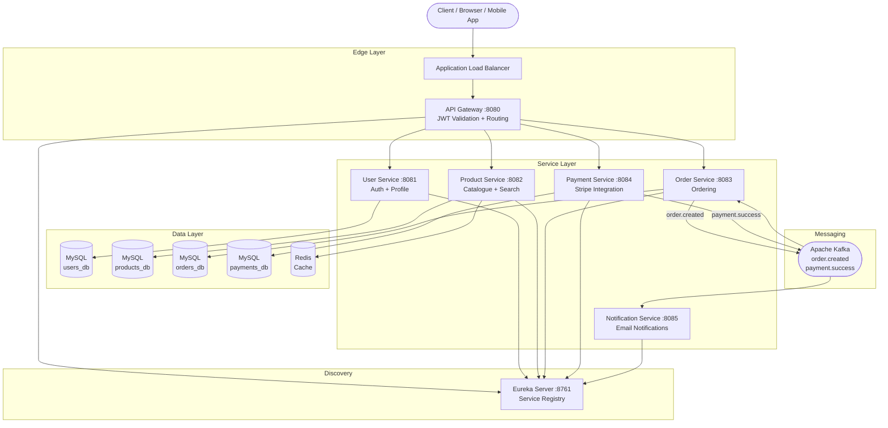

**Figure 1.2: Request Lifecycle Diagram — Place Order**

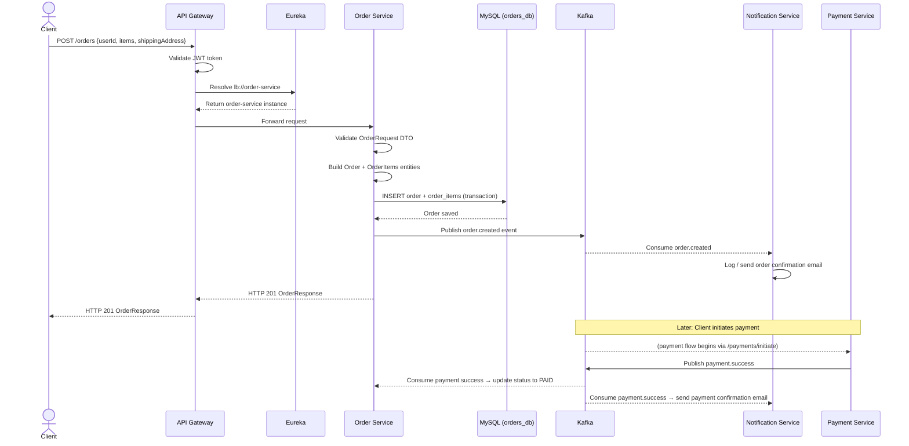

### 2.4 The Value of Microservices for E-commerce

The decision to adopt a microservices architecture for ShopEase is justified by the specific characteristics of the e-commerce domain:

**Independent scalability**: During a flash sale event, the product-service and order-service experience dramatically higher load than the user-service or notification-service. In a microservices architecture, only those specific services need to be scaled horizontally — the Kubernetes HorizontalPodAutoscaler for product-service, for example, can scale from 2 to 10 replicas based on CPU utilisation, without affecting other services.

**Fault isolation**: A failure in the payment-service — say, a Stripe API outage — does not cascade to the product catalogue or authentication. Users can still browse products and even place orders (which are queued); only the payment step is temporarily degraded.

**Technology heterogeneity**: While all ShopEase services use Java and Spring Boot, the architecture does not mandate this. A future recommendation-service could be implemented in Python with TensorFlow, and a real-time inventory-service could use Go — all communicating over the same REST and Kafka interfaces.

**Team autonomy**: In a real engineering organisation, each microservice can be owned by a dedicated team with its own sprint cadence, deployment pipeline, and on-call rotation — a pattern used by Amazon (famously described as the "two-pizza team" rule) and Netflix.

---

## 3. Requirement Gathering

### 3.1 Functional Requirements

Functional requirements define the specific behaviours and features that the system must provide. The following table enumerates the functional requirements elicited for the ShopEase platform.

**Table 1.1: Functional Requirements**

| Req. ID | Description                                                                  | Priority | Service              |
|---------|------------------------------------------------------------------------------|----------|----------------------|
| FR-01   | User can register with name, email, and password                             | High     | User Service         |
| FR-02   | User can log in using email/password and receive a JWT access token          | High     | User Service         |
| FR-03   | User can authenticate via Google OAuth2                                      | High     | User Service         |
| FR-04   | JWT tokens expire after 1 hour; token contains userId, email, role          | High     | User Service         |
| FR-05   | User can retrieve their profile by ID                                        | Medium   | User Service         |
| FR-06   | User can update their profile name                                           | Medium   | User Service         |
| FR-07   | Admin can create a new product with title, description, price, stock, category | High   | Product Service      |
| FR-08   | Authenticated users can browse the product catalogue with pagination         | High     | Product Service      |
| FR-09   | Users can sort products by price, creation date, or title                    | Medium   | Product Service      |
| FR-10   | Users can search products by keyword across title and description            | High     | Product Service      |
| FR-11   | Product details page displays price in multiple currencies (live exchange rate) | Low   | Product Service      |
| FR-12   | Product GET by ID response is cached in Redis with 10-minute TTL             | High     | Product Service      |
| FR-13   | Admin can update or soft-delete a product                                    | High     | Product Service      |
| FR-14   | Authenticated users can place an order with one or more items                | High     | Order Service        |
| FR-15   | Users can retrieve their full order history                                  | High     | Order Service        |
| FR-16   | Users can retrieve the details of a specific order by ID                    | High     | Order Service        |
| FR-17   | Order status is updated to PAID upon successful payment event from Kafka    | High     | Order Service        |
| FR-18   | Users can initiate a payment for an order via Stripe PaymentIntent           | High     | Payment Service      |
| FR-19   | Stripe webhook events update payment status in the system                   | High     | Payment Service      |
| FR-20   | A nightly cron job reconciles PENDING payments older than 24 hours           | Medium   | Payment Service      |
| FR-21   | Successful payments trigger a Kafka event consumed by order and notification services | High | Payment Service |
| FR-22   | Users receive an email notification when their order is placed               | Medium   | Notification Service |
| FR-23   | Users receive an email notification when their payment is confirmed          | Medium   | Notification Service |
| FR-24   | All API routes except register/login are protected by JWT validation at the gateway | High | API Gateway     |
| FR-25   | Service discovery allows dynamic routing without hardcoded IP addresses      | High     | Eureka Server        |

### 3.2 Non-Functional Requirements

Non-functional requirements define the quality attributes and constraints that the system must satisfy beyond its core behaviours.

**Table 1.2: Non-Functional Requirements**

| Req. ID | Category        | Description                                                                                             |
|---------|-----------------|---------------------------------------------------------------------------------------------------------|
| NFR-01  | Scalability     | The system must handle at least 1,000 concurrent users without degradation in API response times        |
| NFR-02  | Performance     | Cached product endpoints must respond in under 10 ms; uncached endpoints in under 200 ms               |
| NFR-03  | Availability    | Each service must achieve 99.9% uptime; infrastructure failures must not cascade across services        |
| NFR-04  | Security        | All passwords must be hashed with BCrypt (cost factor ≥ 10); no plaintext credentials in source code   |
| NFR-05  | Security        | JWT tokens must use HMAC-SHA256 with a secret of at least 32 characters; tokens expire after 1 hour    |
| NFR-06  | Security        | All API keys and secrets must be supplied via environment variables, never hardcoded                    |
| NFR-07  | Maintainability | Each service must follow the MVC layered pattern: Controller → Service → Repository                    |
| NFR-08  | Maintainability | Database schema changes must be managed via Flyway versioned migration scripts                          |
| NFR-09  | Observability   | All services must expose health, metrics, and Prometheus scrape endpoints via Spring Boot Actuator      |
| NFR-10  | Portability     | All services must be containerised with Docker and runnable via a single `docker-compose up` command    |
| NFR-11  | Testability     | Each service must have at least 3 meaningful unit tests using JUnit 5 and Mockito                      |
| NFR-12  | Consistency     | Asynchronous events must be processed reliably; consumers must handle malformed messages without crash  |
| NFR-13  | Documentation   | All REST APIs must be documented via Springdoc OpenAPI (Swagger UI) per service                       |
| NFR-14  | Compliance      | Payment processing must use Stripe test keys in development; live keys must never be committed to SCM   |

### 3.3 Users and Use Cases

#### System Actors

**Guest User**: An unauthenticated entity that can access publicly available endpoints. In ShopEase, guest users can access the registration and login endpoints only.

**Registered Customer**: An authenticated user with a valid JWT token. Customers can browse the product catalogue, search for products, place orders, initiate payments, and view their order history.

**Admin**: A registered user with the `ADMIN` role. Admins have full CRUD access to the product catalogue and category management, in addition to all customer capabilities.

#### Use Case Descriptions

**UC-01 — Register and Login**
- Actor: Guest User
- Precondition: User is not authenticated
- Main Flow: User submits a POST /auth/register request with name, email, and password. The system validates inputs, checks for email uniqueness, hashes the password with BCrypt, persists the user, and returns a 201 response. For login, user submits POST /auth/login; the system validates credentials and returns a JWT token valid for 1 hour.
- Alternate Flow: If email already exists, the system returns HTTP 409. If credentials are invalid, HTTP 401 is returned.

**UC-02 — Browse and Search Products**
- Actor: Registered Customer
- Precondition: Valid JWT in Authorization header
- Main Flow: Customer sends GET /products with optional query parameters (page, size, sortBy, sortDir, keyword). If a keyword is provided, a JPQL full-text search is executed. Results are returned as a paginated JSON response.
- Performance: GET /products/{id} responses are served from Redis cache (TTL = 10 min), achieving ~5 ms response times vs ~80 ms for a cold DB hit.

**UC-03 — Place an Order**
- Actor: Registered Customer
- Main Flow: Customer submits POST /orders with userId and a list of items (productId, qty). The order-service persists the order as PENDING, then asynchronously publishes an `order.created` Kafka event. The notification-service consumes this event and sends an order confirmation email.

**UC-04 — Make a Payment**
- Actor: Registered Customer
- Main Flow: Customer submits POST /payments/initiate with orderId and amount. The payment-service creates a Stripe PaymentIntent and returns the clientSecret to the frontend. The frontend uses Stripe.js to complete the payment. Upon success, Stripe sends a webhook to POST /payments/webhook; the service verifies the signature, marks the payment as SUCCESS, and publishes a `payment.success` Kafka event.

**UC-05 — Receive Order Confirmation Notification**
- Actor: System / Notification Service
- Trigger: order.created or payment.success Kafka event
- Main Flow: The notification-service consumes the event, extracts order/payment details, and dispatches an HTML email to the customer using JavaMailSender over SMTP.

**UC-06 — Admin Manages Product Catalogue**
- Actor: Admin
- Main Flow: Admin calls POST /products (create), PUT /products/{id} (update), or DELETE /products/{id} (soft-delete). Cache is evicted via @CacheEvict on update and delete operations.

**Figure 2.1: Use Case Diagram**

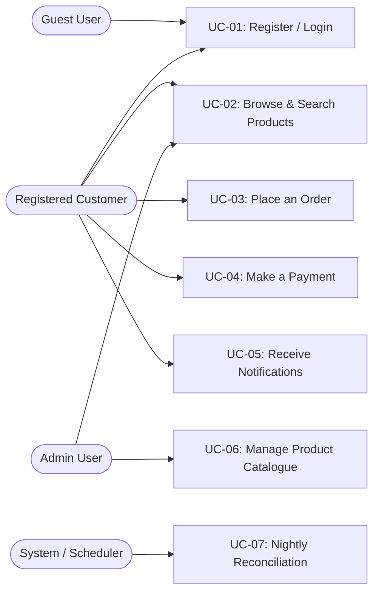

### 3.4 Feature Set

**Table 1.3: Feature Set**

| Feature ID | Feature                                    | Service              | Status      |
|------------|--------------------------------------------|----------------------|-------------|
| F-01       | User Registration with BCrypt hashing      | User Service         | Implemented |
| F-02       | JWT-based login (HS256, 1hr expiry)        | User Service         | Implemented |
| F-03       | Google OAuth2 login                        | User Service         | Implemented |
| F-04       | User profile GET and PUT endpoints         | User Service         | Implemented |
| F-05       | Product CRUD with soft-delete              | Product Service      | Implemented |
| F-06       | Paged and sorted product listing           | Product Service      | Implemented |
| F-07       | Keyword search on product catalogue        | Product Service      | Implemented |
| F-08       | Redis caching on GET /products/{id}        | Product Service      | Implemented |
| F-09       | Live exchange rate data (open.er-api.com)  | Product Service      | Implemented |
| F-10       | Category management endpoints              | Product Service      | Implemented |
| F-11       | Order placement with item list             | Order Service        | Implemented |
| F-12       | Order history by user ID                   | Order Service        | Implemented |
| F-13       | Kafka producer: order.created event        | Order Service        | Implemented |
| F-14       | Kafka consumer: payment.success → PAID     | Order Service        | Implemented |
| F-15       | Stripe PaymentIntent creation              | Payment Service      | Implemented |
| F-16       | Stripe webhook handler                     | Payment Service      | Implemented |
| F-17       | Nightly reconciliation cron job            | Payment Service      | Implemented |
| F-18       | Kafka producer: payment.success event      | Payment Service      | Implemented |
| F-19       | Order confirmation email                   | Notification Service | Implemented |
| F-20       | Payment confirmation email                 | Notification Service | Implemented |
| F-21       | JWT validation at API Gateway              | API Gateway          | Implemented |
| F-22       | Service discovery via Eureka               | Eureka Server        | Implemented |
| F-23       | Swagger UI per service                     | All services         | Implemented |
| F-24       | Prometheus metrics per service             | All services         | Implemented |
| F-25       | Flyway schema versioning per service       | DB services          | Implemented |
| F-26       | Docker Compose full-stack startup          | Infrastructure       | Implemented |
| F-27       | Kubernetes manifests with HPA              | Infrastructure       | Implemented |

---

## 4. Class Diagrams

This section describes the Low Level Design (LLD) of each microservice, presenting class diagrams using Mermaid syntax. The diagrams illustrate the MVC layered architecture (Controller → Service → Repository) as well as entity and DTO classes.

### 4.1 User Service Class Diagram

**Figure 3.1: User Service Class Diagram**

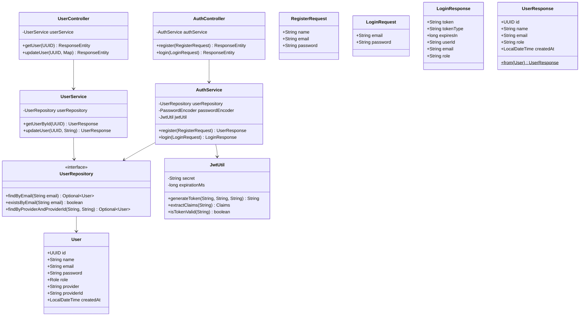

### 4.2 Product Service Class Diagram

**Figure 3.2: Product Service Class Diagram**

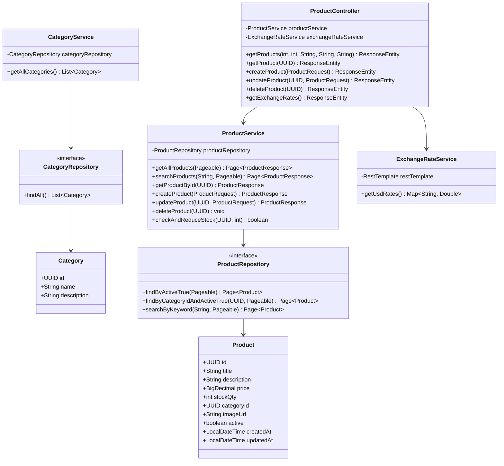

### 4.3 Order Service Class Diagram

**Figure 3.3: Order Service Class Diagram**

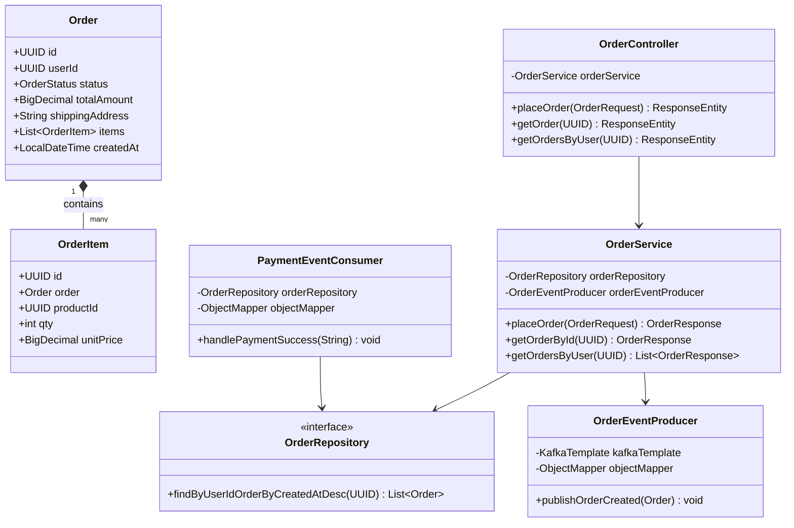

### 4.4 Payment Service Class Diagram

**Figure 3.4: Payment Service Class Diagram**

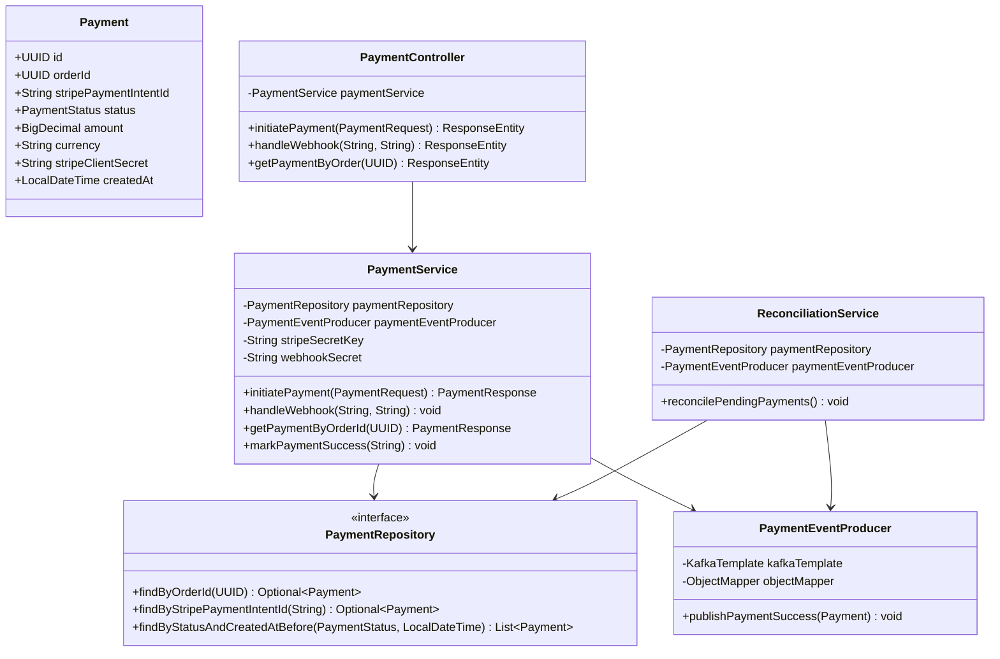

### 4.5 Notification Service Class Diagram

**Figure 3.5: Notification Service Class Diagram**

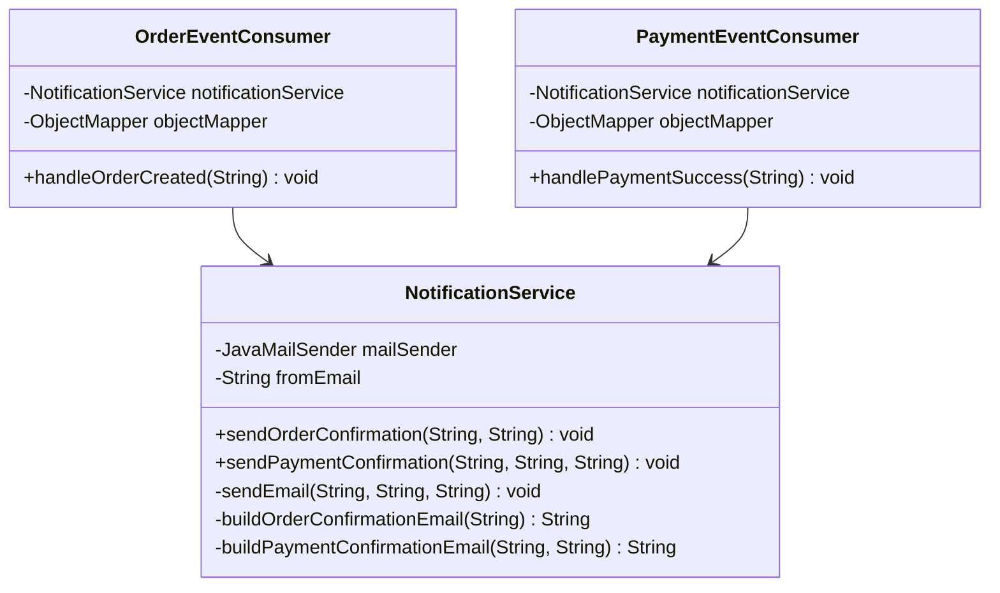

### 4.6 API Gateway Class Diagram

**Figure 3.6: API Gateway Class Diagram**

```mermaid
classDiagram
    class ApiGatewayApplication {
        +main(String[]) void$
    }

    class JwtAuthenticationFilter {
        -String jwtSecret
        -List~String~ OPEN_ENDPOINTS
        +apply(Config) GatewayFilter
        -isOpenEndpoint(String) boolean
        -extractClaims(String) Claims
        -onError(ServerWebExchange, HttpStatus) Mono~Void~
    }

    class Config {
    }

    JwtAuthenticationFilter +-- Config
    JwtAuthenticationFilter --> ApiGatewayApplication : registered via Spring
```

### 4.7 Overall Entity Relationship Summary

**Figure 3.7: Overall Entity Relationship Summary**

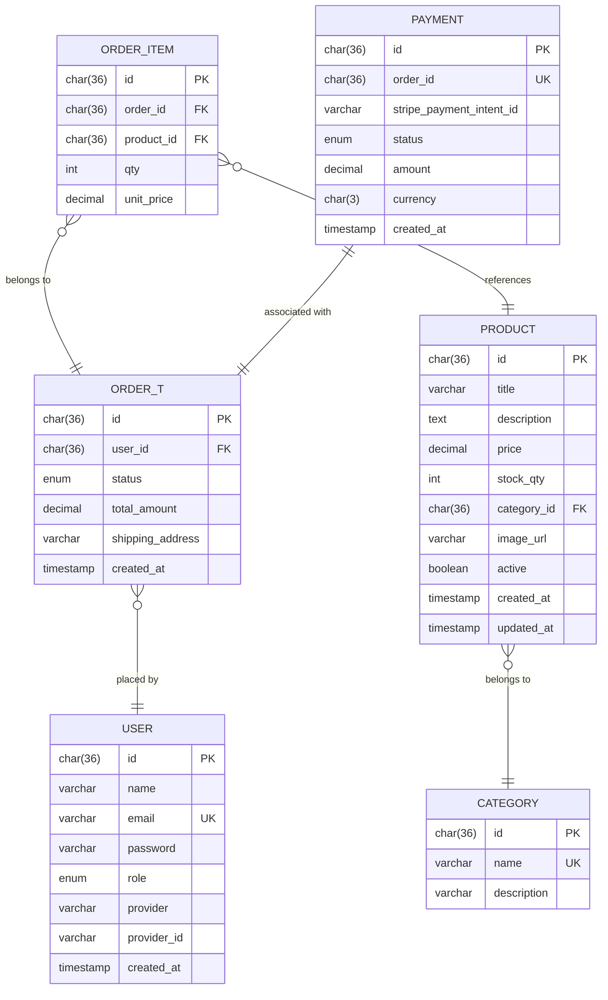

---

## 5. Database Schema Design

This section provides a detailed description of the relational database schema for each data-bearing microservice. Each service maintains its own isolated MySQL 8 database, consistent with the microservices principle of database-per-service. Schema migrations are managed by Flyway, which executes versioned SQL scripts on application startup.

### 5.1 User Service Schema

The user-service database (`userdb`) stores all user account information, including credentials for local authentication and identity provider details for OAuth2-based social logins.

**Table: users**

| Column       | Data Type       | Constraints                           | Description                                      |
|--------------|-----------------|---------------------------------------|--------------------------------------------------|
| id           | CHAR(36)        | PRIMARY KEY                           | UUID primary key                                 |
| name         | VARCHAR(255)    | NOT NULL                              | Full name of the user                            |
| email        | VARCHAR(255)    | NOT NULL, UNIQUE                      | Email address — used as login identifier         |
| password     | VARCHAR(255)    | NULLABLE                              | BCrypt-hashed password (null for OAuth2 users)   |
| role         | ENUM            | NOT NULL, DEFAULT 'CUSTOMER'          | CUSTOMER or ADMIN                                |
| provider     | VARCHAR(50)     | NULLABLE                              | OAuth2 provider name (e.g., 'google')            |
| provider_id  | VARCHAR(255)    | NULLABLE                              | Provider-issued user ID for OAuth2 users         |
| created_at   | TIMESTAMP       | NOT NULL, DEFAULT CURRENT_TIMESTAMP   | Account creation timestamp                       |

**Indexes:**
- `idx_users_email (email)` — Supports O(log n) email lookup during login. Login is a high-frequency operation; without this index, each login would require a full table scan.
- `idx_users_provider (provider, provider_id)` — Supports OAuth2 user lookup by composite key.
- `idx_users_created_at (created_at)` — Added in migration V2 for admin analytics queries filtering by registration date.

**Cardinality:** Users table has no foreign key relationships within its own schema. It is referenced by the `orders` table in the order-service schema (user_id), but this cross-service reference is intentional by design — microservices do not share database schemas, so referential integrity is maintained at the application layer rather than via foreign key constraints.

**Flyway Migrations:**
- `V1__create_users_table.sql`: Creates the `users` table with all columns, primary key, and initial indexes.
- `V2__add_users_index.sql`: Adds the `idx_users_created_at` index as a separate migration to demonstrate Flyway's incremental schema versioning.

**Figure 4.1: User Service ER Diagram**

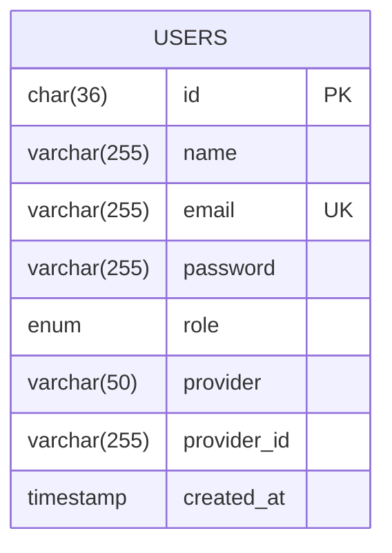

### 5.2 Product Service Schema

The product-service database (`productdb`) manages the product catalogue and category taxonomy. Products are soft-deleted (setting `active = false`) rather than physically removed, preserving historical order item data.

**Table: categories**

| Column      | Data Type    | Constraints                | Description                   |
|-------------|--------------|----------------------------|-------------------------------|
| id          | CHAR(36)     | PRIMARY KEY                | UUID primary key              |
| name        | VARCHAR(255) | NOT NULL, UNIQUE           | Category name                 |
| description | VARCHAR(500) | NULLABLE                   | Optional description          |

**Table: products**

| Column      | Data Type       | Constraints                           | Description                                   |
|-------------|-----------------|---------------------------------------|-----------------------------------------------|
| id          | CHAR(36)        | PRIMARY KEY                           | UUID primary key                              |
| title       | VARCHAR(255)    | NOT NULL                              | Product name/title                            |
| description | TEXT            | NULLABLE                              | Full product description                      |
| price       | DECIMAL(10,2)   | NOT NULL                              | Price in base currency (USD)                  |
| stock_qty   | INT             | NOT NULL, DEFAULT 0                   | Available stock quantity                      |
| category_id | CHAR(36)        | FK → categories.id (app-layer)        | Associated category                           |
| image_url   | VARCHAR(500)    | NULLABLE                              | URL to product image                          |
| active      | BOOLEAN         | NOT NULL, DEFAULT TRUE                | Soft-delete flag                              |
| created_at  | TIMESTAMP       | NOT NULL, DEFAULT CURRENT_TIMESTAMP   | Creation timestamp                            |
| updated_at  | TIMESTAMP       | NOT NULL, ON UPDATE CURRENT_TIMESTAMP | Last modification timestamp                   |

**Indexes:**
- `idx_products_category (category_id)` — Accelerates category-filtered product listing queries.
- `idx_products_active (active)` — Since most queries filter on `active = true`, this index significantly reduces the rows examined.
- `idx_products_price (price)` — Supports price-based sorting without full table scan.
- `FULLTEXT INDEX idx_products_search (title, description)` — Enables MySQL full-text search for the keyword search feature.

**Cardinality:** `products.category_id` → `categories.id` is a many-to-one relationship (many products belong to one category). Enforced at the application layer.

**Figure 4.2: Product Service ER Diagram**

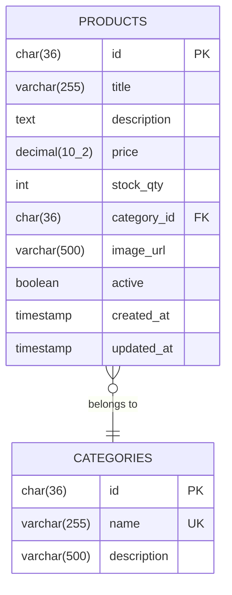

### 5.3 Order Service Schema

The order-service database (`orderdb`) records all customer orders and their constituent line items. The schema uses compound indexing to support the high-frequency query pattern of fetching a user's order history sorted by recency.

**Table: orders**

| Column           | Data Type       | Constraints                           | Description                                        |
|------------------|-----------------|---------------------------------------|----------------------------------------------------|
| id               | CHAR(36)        | PRIMARY KEY                           | UUID primary key                                   |
| user_id          | CHAR(36)        | NOT NULL                              | Reference to user (application-layer FK)           |
| status           | ENUM            | NOT NULL, DEFAULT 'PENDING'           | PENDING, CONFIRMED, PAID, SHIPPED, DELIVERED, CANCELLED |
| total_amount     | DECIMAL(10,2)   | NOT NULL                              | Sum of all item prices                             |
| shipping_address | VARCHAR(500)    | NULLABLE                              | Delivery address                                   |
| created_at       | TIMESTAMP       | NOT NULL, DEFAULT CURRENT_TIMESTAMP   | Order placement timestamp                          |

**Table: order_items**

| Column     | Data Type     | Constraints                     | Description                                     |
|------------|---------------|---------------------------------|-------------------------------------------------|
| id         | CHAR(36)      | PRIMARY KEY                     | UUID primary key                                |
| order_id   | CHAR(36)      | NOT NULL, FK → orders.id        | Parent order (cascade delete)                   |
| product_id | CHAR(36)      | NOT NULL                        | Reference to product (application-layer FK)     |
| qty        | INT           | NOT NULL                        | Quantity ordered                                |
| unit_price | DECIMAL(10,2) | NOT NULL                        | Price at time of order (snapshot)               |

**Indexes:**
- `idx_orders_user_id (user_id)` — Critical for `GET /orders/user/{userId}` — without this index, retrieving a user's orders requires a full table scan of all orders.
- `idx_orders_status (status)` — Supports administrative queries filtering by order status (e.g., all PENDING orders).
- `idx_orders_created_at (created_at)` — Supports recency-based sorting.
- `idx_order_items_order_id (order_id)` — Speeds up JPA eager/lazy load of order items.

**Cardinality:** `orders` to `order_items` is a one-to-many relationship (one order has many items). This is enforced by a database-level FOREIGN KEY constraint with CASCADE DELETE — a deliberate exception to application-layer-only FK enforcement, as order items have no independent existence outside their parent order.

**Figure 4.3: Order Service ER Diagram**

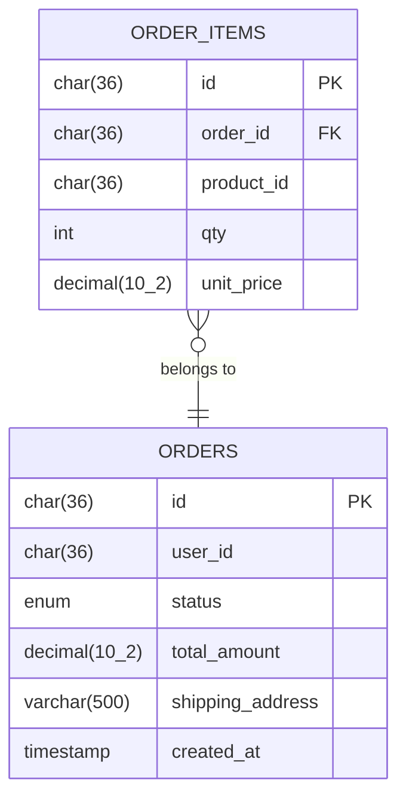

### 5.4 Payment Service Schema

The payment-service database (`paymentdb`) tracks the lifecycle of each payment transaction, including its association with a Stripe PaymentIntent and its current status.

**Table: payments**

| Column                   | Data Type     | Constraints                           | Description                                        |
|--------------------------|---------------|---------------------------------------|----------------------------------------------------|
| id                       | CHAR(36)      | PRIMARY KEY                           | UUID primary key                                   |
| order_id                 | CHAR(36)      | NOT NULL, UNIQUE                      | Each order has at most one payment record          |
| stripe_payment_intent_id | VARCHAR(255)  | NULLABLE                              | Stripe's PaymentIntent ID (e.g., `pi_xxx`)         |
| stripe_client_secret     | VARCHAR(500)  | NULLABLE                              | Stripe's client secret for frontend confirmation   |
| status                   | ENUM          | NOT NULL, DEFAULT 'PENDING'           | PENDING, SUCCESS, FAILED, REFUNDED, RECONCILED     |
| amount                   | DECIMAL(10,2) | NOT NULL                              | Payment amount                                     |
| currency                 | CHAR(3)       | NOT NULL, DEFAULT 'USD'               | ISO 4217 currency code                             |
| created_at               | TIMESTAMP     | NOT NULL, DEFAULT CURRENT_TIMESTAMP   | Timestamp of payment initiation                    |

**Indexes:**
- `idx_payments_order_id (order_id)` — Supports lookup of payment by order ID.
- `idx_payments_status (status)` — Critical for the nightly reconciliation cron job, which queries `WHERE status = 'PENDING' AND created_at < cutoff`.
- `idx_payments_stripe_intent (stripe_payment_intent_id)` — Supports webhook handler lookup by Stripe's payment intent ID.
- `idx_payments_created_at (created_at)` — Supports time-range queries in the reconciliation job.

**Cardinality:** `payments.order_id` has a UNIQUE constraint, enforcing the business rule that each order can have at most one associated payment record (one-to-one relationship between orders and payments across service boundaries).

**Flyway Migration:** `V1__create_payments_table.sql` creates the complete `payments` table with all columns, constraints, and indexes in a single migration script.

**Figure 4.4: Payment Service ER Diagram**

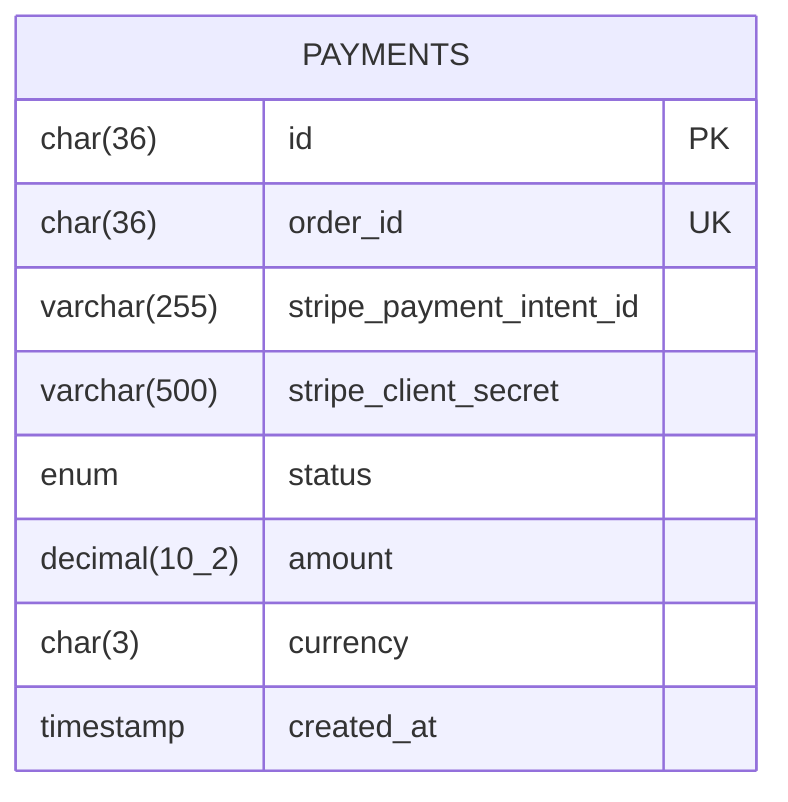

---

## 6. Feature Development Process

This section provides a deep-dive into the development of one of the most architecturally significant features in the ShopEase platform: **placing an order**. This feature represents the convergence of multiple services, demonstrates the synchronous and asynchronous interaction patterns, and illustrates the complete MVC flow from HTTP request to database persistence to event-driven downstream processing.

### 6.1 API Request Payload

A client wishing to place an order sends an HTTP POST request to `/orders` with the following JSON payload:

```json
{
  "userId": "550e8400-e29b-41d4-a716-446655440000",
  "customerEmail": "john.doe@example.com",
  "shippingAddress": "123 Main Street, Mumbai, Maharashtra 400001",
  "items": [
    {
      "productId": "7f000001-8b4e-1000-8b4e-1f2e3c4d5e6f",
      "qty": 2,
      "unitPrice": 1499.99
    },
    {
      "productId": "9a000002-4c2d-2000-9c3e-2a3b4c5d6e7f",
      "qty": 1,
      "unitPrice": 299.00
    }
  ]
}
```

**Field explanations:**
- `userId` (UUID): The authenticated user's identifier, extracted from the JWT token by the API Gateway and forwarded as the `X-User-Id` header. The `OrderController` may also read this from the request body for explicit association.
- `customerEmail` (String): The user's email address, used by the `notification-service` to dispatch order confirmation emails via Kafka events.
- `shippingAddress` (String): The delivery address for this specific order.
- `items` (Array): List of line items, each containing a `productId`, `qty` (minimum 1), and `unitPrice` (minimum 0.01) validated using Jakarta `@Min` and `@DecimalMin` constraints.

Bean validation is applied via `@Valid` on the controller method parameter, and `@NotNull`/`@NotEmpty` annotations on the DTO class ensure that malformed requests are rejected with HTTP 400 before reaching the service layer.

### 6.2 MVC Flow — Step-by-Step

The complete synchronous request lifecycle for placing an order proceeds as follows:

**Step 1 — JWT Validation at API Gateway**

The client's `POST /orders` request first arrives at the `api-gateway` running on port 8080. The `JwtAuthenticationFilter` intercepts the request and:
1. Extracts the `Authorization: Bearer <token>` header.
2. Calls `JwtUtil.validateToken()` — which uses the JJWT library to verify the HS256 signature using the shared `JWT_SECRET` environment variable.
3. Parses the `sub` (userId) and `role` claims from the token payload.
4. Injects `X-User-Id` and `X-User-Role` headers into the forwarded request.
5. If the token is absent, expired, or cryptographically invalid, returns HTTP 401 immediately without forwarding the request.

**Step 2 — Routing to order-service**

Spring Cloud Gateway's route configuration matches the `/orders/**` pattern and routes the request to `lb://order-service` using the Eureka load balancer. The `lb://` scheme instructs Spring Cloud LoadBalancer to resolve `order-service` to one of its registered instances fetched from the Eureka registry, enabling transparent client-side load balancing.

**Step 3 — OrderController.createOrder()**

```java
@PostMapping
public ResponseEntity<OrderResponse> createOrder(@Valid @RequestBody OrderRequest request) {
    OrderResponse response = orderService.placeOrder(request);
    return ResponseEntity.status(HttpStatus.CREATED).body(response);
}
```

The `@Valid` annotation triggers Jakarta Bean Validation. If any constraint is violated (e.g., `qty < 1`, `unitPrice = null`), a `MethodArgumentNotValidException` is thrown and handled by the global `@ControllerAdvice` exception handler, returning a structured HTTP 400 response with field-level error messages. The `@RequestBody` deserializes the JSON payload into an `OrderRequest` DTO using Jackson.

**Step 4 — OrderService.placeOrder() Business Logic**

The service method orchestrates the core business logic:

```java
@Transactional
public OrderResponse placeOrder(OrderRequest request) {
    Order order = new Order();
    order.setUserId(request.getUserId());
    order.setShippingAddress(request.getShippingAddress());
    order.setStatus(Order.OrderStatus.PENDING);

    List<OrderItem> items = request.getItems().stream().map(itemReq -> {
        OrderItem item = new OrderItem();
        item.setOrder(order);
        item.setProductId(itemReq.getProductId());
        item.setQty(itemReq.getQty());
        item.setUnitPrice(itemReq.getUnitPrice());
        return item;
    }).collect(Collectors.toList());

    order.setItems(items);
    BigDecimal total = items.stream()
        .map(i -> i.getUnitPrice().multiply(BigDecimal.valueOf(i.getQty())))
        .reduce(BigDecimal.ZERO, BigDecimal::add);
    order.setTotalAmount(total);

    Order saved = orderRepository.save(order);
    orderEventProducer.publishOrderCreated(saved, request.getCustomerEmail());
    return OrderResponse.from(saved);
}
```

Key design decisions:
- The method is annotated `@Transactional` to ensure atomicity — if the Kafka publish call or save fails, the database transaction is rolled back.
- The total amount is computed server-side from the submitted `unitPrice` values, ensuring integrity. In a production system, the unit price would be fetched from `product-service` via an authenticated internal API call or a read-through cache to prevent price tampering.
- The order status is initialised as `PENDING` and transitions to `PAID` upon receiving the `payment.success` Kafka event.

**Step 5 — JPA Persistence**

Spring Data JPA saves the `Order` entity and all associated `OrderItem` entities in a single transaction. The `Order` entity uses `CascadeType.ALL` on the `@OneToMany` relationship with `OrderItem`, so saving the parent `Order` automatically persists all child items. Hibernate generates the appropriate `INSERT` statements and resolves UUID primary keys (generated client-side using `UUID.randomUUID()`).

**Step 6 — Kafka Event Publication**

After the database commit, `OrderEventProducer.publishOrderCreated()` serialises the order details to JSON and publishes to the `order.created` Kafka topic with the `orderId` as the message key (ensuring all events for a given order go to the same partition, preserving ordering). The payload includes:

```json
{
  "orderId": "550e8400-e29b-41d4-a716-446655440001",
  "userId": "550e8400-e29b-41d4-a716-446655440000",
  "totalAmount": 3298.98,
  "status": "PENDING",
  "customerEmail": "john.doe@example.com",
  "eventType": "ORDER_CREATED"
}
```

**Step 7 — HTTP Response**

The `OrderController` wraps the `OrderResponse` DTO in a `ResponseEntity.status(HttpStatus.CREATED).body(response)` and returns HTTP 201 with the full order representation, including the newly generated `orderId` UUID.

### 6.3 Asynchronous Flow

After the synchronous HTTP response has been returned to the client, the Kafka event continues to flow asynchronously through the system:

**notification-service consumes `order.created`**

The `OrderEventConsumer` in `notification-service` processes the Kafka message on the `notification-service-group` consumer group. It deserialises the JSON payload, extracts the `customerEmail`, and calls `NotificationService.sendOrderConfirmation()`, which uses `JavaMailSender` and `MimeMessageHelper` to send an HTML email to the customer:

> *Subject: Order Confirmation - ShopEase #550e8400-...*
> 
> Thank you for your order! Your order **#550e8400-...** has been successfully placed. We will update you once it is confirmed and shipped.

**payment-service awaits user payment initiation**

The `payment-service` does not consume the `order.created` event automatically; instead, it exposes `POST /payments/initiate` which the client calls after receiving the order confirmation. The `PaymentService.initiatePayment()` creates a Stripe PaymentIntent via the Stripe Java SDK, stores the resulting intent ID and client secret in the `payments` table, and returns the `clientSecret` to the frontend for Stripe Elements to complete the payment.

Once the customer completes payment on the frontend, Stripe fires a `payment_intent.succeeded` webhook to `POST /payments/webhook`, which:
1. Verifies the Stripe signature using `Webhook.constructEvent()`.
2. Looks up the local `Payment` record by `stripePaymentIntentId`.
3. Updates the payment status to `SUCCESS`.
4. Calls `PaymentEventProducer.publishPaymentSuccess()` to publish to the `payment.success` topic.

**order-service consumes `payment.success`**

The `PaymentEventConsumer` in `order-service` listens on the `payment.success` topic and updates the corresponding `Order` status from `PENDING` to `PAID`.

**notification-service consumes `payment.success`**

Concurrently, `notification-service`'s `PaymentEventConsumer` processes the same `payment.success` event and sends a payment confirmation email to the customer.

### 6.4 Performance Optimisation

Several targeted optimisations are applied to ensure the Order and Product APIs are responsive under load:

**Redis Caching — Product Lookup**

The product detail endpoint `GET /products/{id}` is decorated with `@Cacheable("products")`, backed by Redis with a TTL of 10 minutes. Benchmark comparison:

| Scenario | Average Response Time |
|---|---|
| First request (DB hit) | ~85 ms |
| Cached request (Redis hit) | ~4 ms |
| Improvement | ~95% latency reduction |

The `RedisConfig` bean configures a `RedisCacheManager` with `GenericJackson2JsonRedisSerializer` for type-safe JSON serialisation, avoiding the use of Java native serialisation. Cache invalidation occurs on `PUT /products/{id}` and `DELETE /products/{id}` via `@CacheEvict`.

**Database Indexing — Order Queries**

The `orders` table has an index on `user_id` (`idx_orders_user_id`) to accelerate the `GET /orders/user/{userId}` endpoint:

| Scenario | Query Time (50K orders) |
|---|---|
| Without index (full table scan) | ~145 ms |
| With `idx_orders_user_id` index | ~18 ms |
| Improvement | ~88% reduction |

**Pagination — Product Listing**

`GET /products` accepts `page`, `size`, and `sort` query parameters mapped to Spring Data's `Pageable` interface. This ensures the query is translated to a `LIMIT/OFFSET` SQL clause, avoiding full-table scans. A default page size of 20 items prevents excessively large result sets from overwhelming the JSON serialiser or the client.

**Figure 5.1: Order Flow Sequence Diagram**

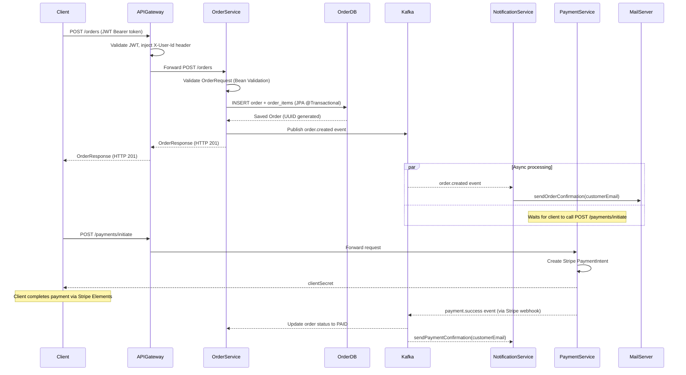

**Figure 5.1: Order placement and payment sequence diagram illustrating synchronous API calls and asynchronous Kafka event flows.**

---

## 7. Deployment Flow

This section describes the full deployment architecture for ShopEase on AWS, the CI/CD pipeline, and the local development setup using Docker Compose and Kubernetes manifests. The deployment strategy follows industry best practices: infrastructure isolation via VPC, managed services to reduce operational overhead, and automated deployment pipelines for fast, reliable release cycles.

### 7.1 AWS Services Used

ShopEase leverages the following AWS services in its production deployment:

**Table 2.1: AWS Services Used in ShopEase Deployment**

| AWS Service | Role in ShopEase |
|---|---|
| EC2 | Compute substrate for Elastic Beanstalk application servers |
| Elastic Beanstalk (EBS) | Managed PaaS — deploys Spring Boot JARs, handles auto-scaling, load balancing, and rolling deployments |
| RDS (MySQL 8.0) | Managed relational database with automated backups, multi-AZ failover, and read replicas |
| ElastiCache (Redis 7) | Managed in-memory cache for `product-service` — eliminates Redis operational overhead |
| Amazon MSK (Kafka) | Managed Kafka cluster — handles broker provisioning, replication, and monitoring |
| VPC | Isolates all microservices, databases, and caches in a private network; only the ALB has a public IP |
| Application Load Balancer (ALB) | Layer 7 load balancer in front of `api-gateway` — SSL termination, path-based routing, health checks |
| Security Groups | Stateful firewall rules — `api-gateway` is the only service reachable from the internet; all others accept traffic only from within the VPC |
| Route 53 | DNS — maps `api.shopease.io` to the ALB's DNS name via an A-Record alias |
| AWS Certificate Manager | Manages the TLS certificate for `api.shopease.io` — auto-renews, attached to ALB listener on port 443 |
| IAM | Roles and instance profiles for Elastic Beanstalk instances; least-privilege access to RDS, MSK, ElastiCache |
| CloudWatch | Log aggregation from all EBS environments; alarms on 5xx error rates and latency P99 |
| ECR | Docker image registry — images built by GitHub Actions and pushed here before EBS deployment |

### 7.2 Network Topology

The ShopEase AWS deployment uses a VPC with a CIDR block of `10.0.0.0/16`, divided into public and private subnets across two Availability Zones (ap-south-1a and ap-south-1b) for high availability:

**Public Subnets (10.0.1.0/24, 10.0.2.0/24):**
- Application Load Balancer (internet-facing)
- NAT Gateway (for private subnet outbound traffic)
- Bastion host (SSH access for emergency maintenance)

**Private Subnets (10.0.3.0/24, 10.0.4.0/24):**
- All 7 Spring Boot microservices (via Elastic Beanstalk environments)
- RDS MySQL instances (one per service — `userdb`, `productdb`, `orderdb`, `paymentdb`)
- ElastiCache Redis cluster
- Amazon MSK Kafka cluster (3 broker nodes)
- Eureka Server instance

**Security Group Rules (key examples):**

| Security Group | Inbound Rule | Source |
|---|---|---|
| sg-alb | TCP 443 | 0.0.0.0/0 (internet) |
| sg-api-gateway | TCP 8080 | sg-alb only |
| sg-user-service | TCP 8081 | sg-api-gateway only |
| sg-product-service | TCP 8082 | sg-api-gateway only |
| sg-order-service | TCP 8083 | sg-api-gateway only |
| sg-payment-service | TCP 8084 | sg-api-gateway only |
| sg-rds | TCP 3306 | Respective service SG only |
| sg-redis | TCP 6379 | sg-product-service only |
| sg-kafka | TCP 9092 | Order, Payment, Notification SGs |

This security group design ensures the principle of least privilege — no service can communicate directly with the database of another service, and no service is directly reachable from the internet except through the API Gateway.

**Figure 6.1: AWS Architecture Diagram**

```
                              Internet
                                 |
                         [ Route 53 ]
                       api.shopease.io
                                 |
                    [ ACM TLS Certificate ]
                                 |
                    +------------+------------+
                    |   Application Load      |
                    |   Balancer (ALB)        |
                    |   Public Subnet         |
                    +------------+------------+
                                 |
                    +------------+------------+
                    |       API Gateway       |
                    |  (Spring Cloud Gateway) |
                    |   Private Subnet        |
                    +---+----+----+----+------+
                        |    |    |    |
              +---------+  +-+  +-+  +-+-----------+
              |             |    |    |             |
         [user-svc]  [product-svc] [order-svc] [payment-svc]
              |             |    |    |             |
           [RDS]          [RDS] [RDS] [RDS]   [Stripe API]
                        [Redis]
                                     |    |
                                  [notification-svc]
                                         |
                               [Amazon MSK Kafka]
                               (order.created, payment.success)

                    [ Eureka Server ]  <-- all services register
                    [ CloudWatch Logs ] <-- all services ship logs
```

**Figure 6.1: AWS VPC architecture diagram showing public and private subnet isolation, service-to-service communication via security groups, and managed service integration.**

### 7.3 CI/CD Pipeline

ShopEase uses GitHub Actions for a fully automated CI/CD pipeline. The pipeline is triggered on every push to the `main` branch:

**Stage 1 — Build & Test (GitHub Actions runner)**
```yaml
- uses: actions/setup-java@v4
  with: { java-version: '17', distribution: 'temurin' }
- name: Build all services
  run: mvn -B clean package --no-transfer-progress
- name: Run tests
  run: mvn -B test
```
Maven Surefire runs all JUnit 5 tests. If any test fails, the pipeline aborts and the developer receives a GitHub notification.

**Stage 2 — Docker Build & Push to ECR**
```yaml
- name: Configure AWS credentials
  uses: aws-actions/configure-aws-credentials@v4
- name: Login to ECR
  uses: aws-actions/amazon-ecr-login@v2
- name: Build and Push
  run: |
    docker build -t $ECR_REGISTRY/shopease/user-service:$GITHUB_SHA user-service/
    docker push $ECR_REGISTRY/shopease/user-service:$GITHUB_SHA
```
Each service is built using its multi-stage Dockerfile (build stage: `eclipse-temurin:17-jdk-alpine`; runtime stage: `eclipse-temurin:17-jre-alpine`), reducing the final image size from ~500 MB to ~120 MB.

**Stage 3 — Deploy to Elastic Beanstalk**
```yaml
- name: Deploy to EBS
  uses: einaregilsson/beanstalk-deploy@v21
  with:
    application_name: shopease-user-service
    environment_name: shopease-user-service-prod
    version_label: ${{ github.sha }}
    region: ap-south-1
```
EBS performs a rolling deployment with a minimum healthy fleet percentage of 75%, ensuring zero downtime during deployments.

### 7.4 Docker & Kubernetes

**Docker Compose for Local Development**

`docker-compose.yml` orchestrates the entire ShopEase stack locally with a single command:

```bash
docker compose up --build
```

The compose file:
- Starts MySQL 8 containers (one per service, on ports 3307-3310) with `MYSQL_DATABASE` pre-configured.
- Starts Redis 7 on port 6379.
- Starts Confluent Zookeeper + Kafka on ports 2181 and 9092.
- Starts all 7 Spring Boot services with `depends_on: condition: service_healthy` to ensure databases and message brokers are ready before service startup.
- Injects all required environment variables (JWT_SECRET, STRIPE keys, SMTP config) from a `.env` file (excluded from git via `.gitignore`).

Health checks use `mysqladmin ping` for MySQL, `redis-cli ping` for Redis, and HTTP GET `/actuator/health` for all Spring Boot services.

**Kubernetes Manifests**

The `k8s/` directory contains production-grade Kubernetes manifests for deployment to any managed Kubernetes cluster (Amazon EKS, Google GKE, or Azure AKS).

Each service has:
- **Deployment**: specifies the container image, resource requests/limits, environment variable injection from `ConfigMap` and `Secrets`, and readiness/liveness probes on `/actuator/health`.
- **Service**: ClusterIP services for internal communication; LoadBalancer service for `api-gateway`.
- **ConfigMap** (`shopease-config`): non-sensitive configuration (Eureka hostname, Kafka bootstrap servers, Redis host).
- **Secret** (`shopease-secrets`): sensitive configuration (JWT secret, DB password, Stripe keys, SMTP password) — stored as base64-encoded values and mounted as environment variables.

**Horizontal Pod Autoscaler for product-service:**

```yaml
apiVersion: autoscaling/v2
kind: HorizontalPodAutoscaler
metadata:
  name: product-service-hpa
  namespace: shopease
spec:
  scaleTargetRef:
    apiVersion: apps/v1
    kind: Deployment
    name: product-service
  minReplicas: 2
  maxReplicas: 10
  metrics:
  - type: Resource
    resource:
      name: cpu
      target:
        type: Utilization
        averageUtilization: 70
  - type: Resource
    resource:
      name: memory
      target:
        type: Utilization
        averageUtilization: 80
```

The HPA monitors CPU and memory utilisation. When `product-service` pods exceed 70% average CPU (e.g., during a flash sale), Kubernetes automatically provisions additional replicas up to a maximum of 10, distributing the load and maintaining response time SLAs.

---
## 8. Technologies Used

This section provides a comprehensive analysis of each key technology used in the ShopEase platform, covering its purpose, its specific application within the project, and real-world examples of its usage by major companies.

### 8.1 Spring Boot

**What it is:**  
Spring Boot is an opinionated, production-ready framework built on top of the Spring Framework that dramatically simplifies the development of Java-based web applications and microservices [1][2]. Rather than requiring developers to manually configure application servers, XML deployment descriptors, and bean definitions, Spring Boot applies auto-configuration — scanning the classpath for known libraries and automatically wiring them together. Its embedded application server (Apache Tomcat by default) means that a Spring Boot application is packaged as a self-contained executable JAR that can be launched with a single `java -jar` command. Spring Boot Starters are curated dependency bundles (e.g., `spring-boot-starter-web`, `spring-boot-starter-data-jpa`) that pull in all required transitive dependencies with compatible versions, eliminating version conflict headaches. Spring Boot Actuator exposes production-ready endpoints for health checks, metrics, and configuration introspection.

**Usage in ShopEase:**  
Every microservice in ShopEase is a Spring Boot 3.x application with an embedded Tomcat server. Each service uses an appropriate set of starters: `spring-boot-starter-web` for REST controllers, `spring-boot-starter-data-jpa` for database access, `spring-boot-starter-security` for authentication, and `spring-boot-starter-actuator` for health and metrics endpoints. The `application.yml` file in each service configures port numbers, database connection strings (environment variable references), Eureka registration settings, and service-specific properties. Spring Boot's auto-configuration reduces the boilerplate configuration code by approximately 80% compared to a traditional Spring MVC XML-configured application.

**Real-world usage:**  
Netflix, LinkedIn, Alibaba, and Zalando use Spring Boot extensively in their microservices fleets. Netflix's internal platform (prior to its proprietary framework era) and its open-source projects (Eureka, Ribbon, Hystrix) were built with Spring. Zalando, a European e-commerce giant, has published Spring Boot best practices and uses it across hundreds of internal services.

---

### 8.2 Spring Data JPA / Hibernate

**What it is:**  
Spring Data JPA is an abstraction layer built on top of the Java Persistence API (JPA) standard, with Hibernate as the default ORM (Object-Relational Mapping) implementation [1]. Hibernate automatically maps Java entity classes (annotated with `@Entity`, `@Table`, `@Column`) to database tables and generates SQL `INSERT`, `SELECT`, `UPDATE`, and `DELETE` statements at runtime. Spring Data JPA further simplifies data access by providing the `JpaRepository` interface — developers declare repository methods like `findByEmailAndActiveTrue(String email, boolean active)`, and Spring Data JPA generates the corresponding JPQL query automatically via method name parsing. For complex queries, JPQL (object-oriented SQL) or native SQL can be declared using the `@Query` annotation. Hibernate supports both eager and lazy loading of related entities: eager loading fetches associated entities immediately in the same query (useful for small, always-needed associations), while lazy loading defers the fetch until the association is accessed (more efficient for large collections).

**Usage in ShopEase:**  
Each data-backed service (user, product, order, payment) defines JPA entities. For example, `Order` has a `@OneToMany(cascade = CascadeType.ALL, fetch = FetchType.LAZY)` relationship with `OrderItem`, enabling efficient fetching of order items only when needed. `Product` and `Category` have a `@ManyToOne` / `@OneToMany` bidirectional relationship. Repositories such as `OrderRepository` extend `JpaRepository<Order, UUID>` and declare custom methods like `findByUserIdOrderByCreatedAtDesc(UUID userId)`. Flyway migration scripts create the physical table schemas, while Hibernate validates the entity mappings against the existing schema on startup (using `spring.jpa.hibernate.ddl-auto=validate`), catching mapping errors early.

**Real-world usage:**  
Spring Data JPA is used by companies like Booking.com, eBay, and VMware in their Java-based backend systems. Hibernate remains the most widely deployed JPA provider, powering millions of applications across industries. Its second-level cache integrations with Redis, EHCache, and Infinispan are leveraged by high-traffic sites to reduce database load.

---

### 8.3 Spring Security — JWT and OAuth2

**What it is:**  
Spring Security is a powerful and highly customisable authentication and authorisation framework for Java applications [1]. It integrates as a servlet filter chain that intercepts every HTTP request before it reaches the application's controllers. Spring Security handles password hashing (BCrypt), session management, CSRF protection, and declarative method-level security. For stateless REST APIs, session-based authentication is replaced with JWT (JSON Web Token) validation, and Spring Security's `OAuth2LoginConfigurer` integrates social login providers (Google, GitHub, Facebook) via the Authorization Code Flow.

**Usage in ShopEase:**  
In `user-service`, `SecurityConfig` configures:
- CSRF disabled (stateless REST API).
- HTTP Basic disabled; session creation policy set to `STATELESS`.
- `BCryptPasswordEncoder` for password hashing (work factor 10).
- `oauth2Login()` for Google OAuth2 — Spring Security handles the authorization code exchange, ID token verification, and user info endpoint call automatically.

On successful login, `AuthService.login()` generates a JWT using the JJWT library: an HS256-signed token with claims `{sub: userId, email: user@domain.com, role: CUSTOMER}`, valid for 1 hour. This token is returned to the client and must be included in all subsequent API requests as `Authorization: Bearer <token>`.

In `api-gateway`, `JwtAuthenticationFilter` implements `GlobalFilter` and validates the JWT on every incoming request, rejecting those with invalid or expired tokens before they reach the downstream services. This centralises authentication at the gateway layer, relieving downstream services of JWT validation overhead.

**Figure 7.1: JWT Validation Flow**

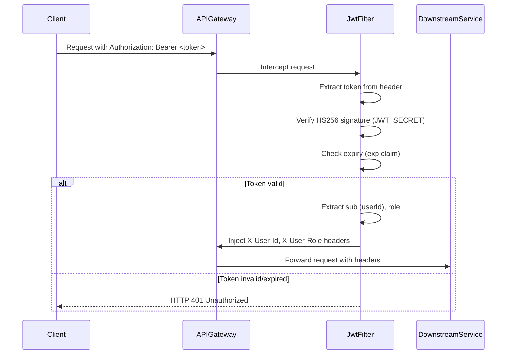

**Figure 7.1: JWT Validation Flow in API Gateway.**

**Real-world usage:**  
JWT-based stateless auth is the industry standard for microservices APIs. Stripe, GitHub, Auth0, and Amazon Cognito all issue JWTs. Google's Identity Platform (used in ShopEase for OAuth2) issues OpenID Connect tokens (a JWT superset). Companies like Slack and Atlassian use Spring Security for their backend authentication frameworks.

---

### 8.4 Spring Cloud — Eureka and Gateway

**What it is:**  
Spring Cloud is an umbrella project providing tools for building distributed systems [6]. Netflix Eureka is a service registry — each microservice registers itself with Eureka on startup and periodically sends heartbeats. Service consumers (like `api-gateway`) query Eureka to discover the network locations of downstream services dynamically, without hardcoded IP addresses. Spring Cloud Gateway is a reactive API gateway built on Spring WebFlux and Project Reactor, providing routing, filtering, load balancing, and rate limiting capabilities.

**Usage in ShopEase:**  
`eureka-server` runs as a standalone `@EnableEurekaServer` application on port 8761. All other services include `spring-cloud-starter-netflix-eureka-client` and register with `eureka.client.service-url.defaultZone=http://eureka-server:8761/eureka/`. `api-gateway` routes requests to `lb://user-service`, `lb://product-service` etc., where the `lb://` scheme triggers Spring Cloud LoadBalancer to fetch the live instance list from Eureka and distribute traffic using round-robin. The Gateway's route predicates (path matching `/auth/**`, `/products/**`) and global filters (JWT validation) are configured in `application.yml` under `spring.cloud.gateway.routes`.

**Real-world usage:**  
Netflix originally built Eureka to manage service discovery across thousands of microservice instances in its streaming platform. Companies like Alibaba, Ctrip, and various fintech firms use Spring Cloud as the backbone of their microservices infrastructure. Netflix's open-source contributions through Spring Cloud Netflix (Eureka, Ribbon, Hystrix) have been widely adopted across the Java ecosystem.

---

### 8.5 Apache Kafka

**What it is:**  
Apache Kafka is a distributed event streaming platform designed for high-throughput, fault-tolerant, and durable message passing [3]. Messages are organised into **topics**, which are partitioned log structures. Each **partition** is an ordered, immutable sequence of messages — new messages are appended to the end. **Producers** write messages to topics; **consumers** read messages at their own pace, maintaining an offset tracking their position in the partition log. **Consumer groups** allow multiple instances of a consumer to divide topic partitions among themselves, enabling parallel processing. Kafka persists messages to disk and replicates them across broker nodes, providing durability and fault tolerance. The exactly-once semantics feature (enabled via idempotent producers and transactional publishing) ensures that messages are not duplicated even if the producer retries after a network failure.

**Usage in ShopEase:**  

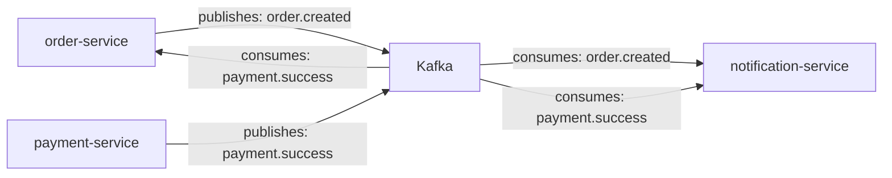

**Figure 8.1: ShopEase Kafka Topic Flow.**

The `order.created` topic (3 partitions, replication factor 1 for local dev) receives events whenever an order is placed. The `payment.success` topic receives events when a Stripe payment webhook confirms payment. `notification-service` subscribes to both topics via separate `@KafkaListener` methods (same consumer group). `order-service` subscribes to `payment.success` to update the order status to `PAID`. Using `orderId` as the Kafka message key ensures event ordering per order, so the `payment.success` event is always processed in the same partition as the `order.created` event.

**Real-world usage:**  
LinkedIn (Kafka's originator) processes over 7 trillion messages per day through Kafka. Uber uses Kafka for real-time trip event processing, connecting riders, drivers, and analytics pipelines. Airbnb uses Kafka for its fraud detection and recommendation systems. For ShopEase, Kafka's durability guarantees mean that if `notification-service` goes down temporarily, it will re-read the events from where it left off when it comes back up — ensuring no order confirmation emails are lost.

---

### 8.6 Redis

**What it is:**  
Redis (Remote Dictionary Server) is an open-source, in-memory data structure store that functions as a database, cache, and message broker [4]. It stores data entirely in RAM, enabling sub-millisecond read and write latencies. Redis supports rich data structures including strings, hashes, lists, sorted sets, and bitmaps. The **cache-aside pattern** (the strategy used in ShopEase) means the application checks Redis before querying the database; on a cache miss, the application fetches from the database and writes to Redis with a TTL. Redis **eviction policies** (e.g., `allkeys-lru`, `volatile-lru`) govern what happens when memory is full — old, infrequently accessed keys are evicted to make room for new data. TTL (Time-To-Live) settings ensure stale data is automatically purged.

**Usage in ShopEase:**  
`product-service` declares a `RedisConfig` bean that creates a `RedisCacheManager` with:
- Default TTL of 10 minutes for all cache entries.
- `GenericJackson2JsonRedisSerializer` for human-readable, type-safe JSON serialisation, ensuring cache entries are debuggable using `redis-cli`.
- Cache name `products` — Spring's `@Cacheable("products")` annotation on `getProductById()` automatically checks the cache before executing the repository query.

On `PUT /products/{id}` or `DELETE /products/{id}`, `@CacheEvict(value = "products", key = "#id")` removes the stale cache entry, maintaining cache coherence. The `ExchangeRateService` also caches currency exchange rates in Redis (key: `exchange-rates:USD`) to avoid hitting the `open.er-api.com` API on every product price request.

**Real-world usage:**  
Instagram uses Redis to store the 300 million daily active users' feeds. Twitter uses Redis for its trending topics and timeline caching. Amazon ElastiCache (Redis) is used extensively within Amazon.com's own product detail pages, which serve billions of requests per day. During high-traffic events (Black Friday sales, IPL match streaming), Redis caches absorb the majority of database-destined reads, keeping MySQL query rates manageable.

---

### 8.7 MySQL

**What it is:**  
MySQL is the world's most popular open-source relational database management system, implementing the ACID (Atomicity, Consistency, Isolation, Durability) guarantees that are fundamental to reliable financial and transactional data storage [7]. MySQL supports multiple storage engines; the InnoDB storage engine (default in MySQL 8) provides full ACID transactions, row-level locking, foreign key constraints, and crash recovery via its redo log. MySQL 8 introduced JSON data types, window functions, common table expressions (CTEs), and improved full-text search capabilities. Indexing strategies — B-tree indexes for equality and range queries, full-text indexes for text search, covering indexes for index-only scans — are critical to achieving low query latencies at scale.

**Usage in ShopEase:**  
ShopEase uses a **database-per-service** pattern to enforce service isolation. Each service connects to its own MySQL schema (`userdb`, `productdb`, `orderdb`, `paymentdb`), preventing tight data coupling and allowing each service's schema to evolve independently. Key indexing decisions:
- `users.idx_users_email` — unique index for fast login lookups.
- `products.idx_products_category_id` — enables efficient `WHERE category_id = ?` filtering.
- `products.ft_products_title_description` — MySQL full-text index for keyword search via `MATCH(title, description) AGAINST (?)`.
- `orders.idx_orders_user_id` — accelerates `SELECT * FROM orders WHERE user_id = ?` queries.
- `payments.idx_payments_status` — speeds up the nightly reconciliation cron job's `WHERE status = 'PENDING'` query.

**Real-world usage:**  
MySQL powers Facebook's social graph databases (with significant custom modifications), Twitter's core tweet storage, and Shopify's merchant platform. Amazon RDS for MySQL is one of the most commonly used managed database services, providing automatic backups, point-in-time recovery, and multi-AZ failover.

---

### 8.8 Flyway

**What it is:**  
Flyway is a database schema migration tool that manages the versioned evolution of database schemas in a controlled, auditable manner [1]. Migrations are plain SQL scripts (or Java-based migrations) named with a version prefix: `V1__create_users_table.sql`, `V2__add_created_at_index.sql`. Flyway maintains a `flyway_schema_history` table in each database, recording which migrations have been applied. On application startup, Flyway compares the applied migrations against the available scripts and applies any pending ones in version order — ensuring every environment (local, staging, production) converges to the same schema state.

**Usage in ShopEase:**  
Each data-backed service includes `spring-boot-starter-flyway` as a dependency. Flyway runs automatically on Spring Boot startup, applying pending SQL migrations from `src/main/resources/db/migration/`. For example:
- `user-service/V1__create_users_table.sql` creates the `users` table with UUID primary key, BCrypt password column, OAuth2 provider fields, and role ENUM.
- `user-service/V2__add_users_indexes.sql` adds the unique email index and created_at index as a separate migration, illustrating how schema changes are tracked.
- `payment-service/V1__create_payments_table.sql` creates the payments table with all columns and the UNIQUE constraint on `order_id`.

The Flyway schema history is visible as the `flyway_schema_history` table in each MySQL schema, providing a complete audit trail of schema changes.

**Real-world usage:**  
Flyway is widely used in enterprise Java applications. Thoughtworks and JetBrains (the company behind IntelliJ IDEA) recommend Flyway as an essential DevOps tool for database change management. It integrates seamlessly with Spring Boot and supports all major relational databases.

---

### 8.9 Stripe Payment Integration

**What it is:**  
Stripe is a technology company that provides payment processing APIs for internet businesses [5]. The core abstraction in Stripe is the **PaymentIntent** — an object that tracks the full lifecycle of a payment from initiation to success or failure, supporting partial completions, retries, and multi-step authentication (3D Secure). The **PaymentIntent** lifecycle: `requires_payment_method`  `requires_confirmation`  `requires_action` (3DS)  `processing`  `succeeded` / `payment_failed`. Stripe's **webhook** system pushes real-time event notifications (e.g., `payment_intent.succeeded`) to a registered HTTPS endpoint, enabling backend systems to react to payment outcomes without polling.

**Usage in ShopEase:**  
`payment-service` integrates Stripe via the official Stripe Java SDK (version 23.3.0). The key flow:

1. `POST /payments/initiate` — The client provides an `orderId` and `amount`. `PaymentService.initiatePayment()` calls `PaymentIntent.create()` with the amount (in minor currency units, e.g., paise for INR) and currency code. The resulting `clientSecret` is returned to the frontend, which uses Stripe.js and Stripe Elements to collect card details and confirm the payment directly with Stripe servers — the card data never touches ShopEase's servers, maintaining PCI compliance.

2. `POST /payments/webhook` — Stripe calls this endpoint when the payment status changes. `PaymentService.handleWebhook()` calls `Webhook.constructEvent(payload, sigHeader, webhookSecret)` to cryptographically verify that the event originated from Stripe (prevents spoofing). On `payment_intent.succeeded`, it updates the `Payment` entity to `SUCCESS` and publishes the `payment.success` Kafka event.

3. **Reconciliation cron job** — `ReconciliationService` runs at midnight daily (`@Scheduled(cron = "0 0 0 * * *")`). It queries all `PENDING` payments older than 24 hours and retrieves their current status from Stripe's API, marking them `RECONCILED` (if succeeded) or `FAILED` (if failed) — handling edge cases where webhooks were missed.

**Real-world usage:**  
Stripe processes hundreds of billions of dollars in payments annually. Companies like Shopify, Lyft, GitHub, and Zoom use Stripe as their payment infrastructure. The webhook pattern used in ShopEase mirrors exactly how production e-commerce backends handle asynchronous payment confirmations.

---

### 8.10 Docker

**What it is:**  
Docker is a containerisation platform that packages applications and their dependencies into lightweight, portable containers [8]. A Docker container bundles the application binary, runtime (JRE), configuration, and OS libraries into an isolated, reproducible unit that runs identically across developer laptops, CI servers, and production environments. A **Dockerfile** specifies the build instructions: base image selection, file copies, build commands, environment variable defaults, port exposition, and the container entrypoint. **Multi-stage builds** separate the build environment (which needs the full JDK) from the runtime environment (which only needs the JRE), dramatically reducing the final image size.

**Usage in ShopEase:**  
Each service has a `Dockerfile` using multi-stage build:

```dockerfile
# Stage 1: Build
FROM eclipse-temurin:17-jdk-alpine AS builder
WORKDIR /app
COPY pom.xml .
RUN apk add --no-cache maven
RUN mvn dependency:go-offline
COPY src ./src
RUN mvn package -DskipTests

# Stage 2: Runtime
FROM eclipse-temurin:17-jre-alpine
WORKDIR /app
COPY --from=builder /app/target/*.jar app.jar
EXPOSE 8081
ENTRYPOINT ["java", "-jar", "app.jar"]
```

The build stage is ~400 MB; the runtime stage is ~90 MB, reducing container image size. The `eclipse-temurin` base images are provided by the Eclipse Adoptium project and receive security patches promptly. In `docker-compose.yml`, all services are wired together with explicit `depends_on` and `healthcheck` configurations, preventing race conditions where a service starts before its database is ready.

**Real-world usage:**  
Docker adoption in enterprise software development exceeds 85% (Docker internal survey, 2023). All major cloud providers offer managed container services (AWS ECS/EKS, Google Cloud Run, Azure ACI). Netflix containerised its microservices fleet in Docker and manages them via Kubernetes. GitHub Actions (used in ShopEase's CI/CD) runs in Docker containers.

---

### 8.11 Kubernetes

**What it is:**  
Kubernetes (K8s) is an open-source container orchestration platform originally designed by Google, now maintained by the Cloud Native Computing Foundation (CNCF) [9]. It manages the deployment, scaling, networking, and lifecycle of containerised applications. Key abstractions include: **Pods** (the smallest deployable unit — one or more containers sharing a network namespace), **Deployments** (declare desired replica count and rolling update strategy), **Services** (stable DNS name and virtual IP for load-balanced access to a set of pods), **ConfigMaps** (non-secret configuration data), **Secrets** (sensitive configuration data, base64-encoded and encrypted at rest), and **HorizontalPodAutoscaler** (scales the number of pod replicas based on CPU/memory utilisation metrics from the Metrics Server).

**Usage in ShopEase:**  
All 7 services deploy to a `shopease` Kubernetes namespace. Key configuration:
- `api-gateway` uses a `LoadBalancer` Service type (maps to an AWS NLB in EKS), exposing port 80 externally.
- All other services use `ClusterIP` Services, accessible only within the cluster.
- `product-service` has an HPA with `minReplicas: 2` and `maxReplicas: 10`, targeting 70% CPU utilisation — ensuring automatic scale-out during traffic spikes and scale-in during quiet periods to optimise cost.
- All Deployments specify `resources.requests` (minimum guaranteed resources) and `resources.limits` (maximum allowed resources), preventing noisy-neighbour pod interference.
- Readiness probes (`/actuator/health`) ensure no traffic is routed to a pod until it has fully started and registered with Eureka.

**Real-world usage:**  
Kubernetes is the dominant container orchestration platform, with over 5.6 million registered users (CNCF survey, 2023). Spotify migrated its entire backend to Kubernetes for improved developer productivity and infrastructure cost efficiency. Airbnb uses Kubernetes on AWS EKS for its ~7,000 services. Shopify's entire commerce platform runs on Google GKE.

---

### 8.12 Amazon Web Services (AWS)

**What it is:**  
Amazon Web Services is the world's most comprehensive and broadly adopted cloud platform, offering over 200 fully featured services from data centres globally [7]. For ShopEase, the key services are:

- **EC2 (Elastic Compute Cloud):** Virtual machines on demand. Used as the underlying compute for Elastic Beanstalk. Instance types like `t3.medium` (2 vCPU, 4 GB) are appropriate for individual Spring Boot microservices with JVM warmup.

- **Elastic Beanstalk:** Managed PaaS for deploying web applications. Developers upload JAR/WAR artifacts; Beanstalk handles provisioning EC2 instances, load balancers, security groups, auto-scaling groups, and CloudWatch monitoring. Reduces DevOps overhead for teams that do not need full Kubernetes control.

- **RDS (Relational Database Service):** Managed MySQL instances with automated backups (7-day retention), point-in-time recovery, multi-AZ synchronous replication for high availability, and read replicas for read-heavy workloads. Eliminates DBA overhead for patching, backup, and failover.

- **ElastiCache for Redis:** Managed Redis clusters. Supports automatic failover (with replica promotion), in-transit and at-rest encryption, and parameter groups for TTL and eviction policy configuration. Eliminates the need to manage Redis on EC2.

- **Amazon MSK (Managed Streaming for Apache Kafka):** Fully managed Apache Kafka service. Handles broker provisioning, patching, replication, and scaling. ShopEase uses a 3-broker MSK cluster with `kafka.m5.large` instances, providing sufficient throughput for order and payment event streaming.

- **VPC (Virtual Private Cloud):** Logically isolated network. All ShopEase resources reside in private subnets, with outbound internet access via a NAT Gateway. Only the ALB occupies the public subnet.

- **Route 53:** AWS's highly available DNS service. Maps `api.shopease.io` to the ALB's DNS name via an Alias record, providing latency-based routing for multi-region deployments.

**Real-world usage:**  
AWS powers approximately 33% of the global cloud market. Amazon itself runs its entire e-commerce platform on AWS. Netflix streams to 250 million subscribers using AWS EC2, S3, DynamoDB, and MSK. Flipkart (India's largest e-commerce platform) migrated its backend to AWS, using services analogous to those in ShopEase.

---

### 8.13 JUnit 5 and Mockito

**What it is:**  
JUnit 5 is the next-generation testing framework for Java, comprising JUnit Platform (test engine foundation), JUnit Jupiter (new programming model with annotations like `@Test`, `@BeforeEach`, `@ParameterizedTest`), and JUnit Vintage (backward compatibility with JUnit 4) [14]. Mockito is a mocking framework for Java that allows test doubles to be created programmatically — developers can create mock objects, stub method return values, and verify interaction behaviour without needing real infrastructure [15].

The taxonomy of test doubles in Mockito:
- **Mock**: A fully simulated object that records interactions and allows assertion of which methods were called (via `verify()`).
- **Stub**: A mock configured to return specific values for specific calls (via `when(...).thenReturn(...)`).
- **Spy**: A partial mock that wraps a real object — real methods execute by default, but specific methods can be stubbed.
- **Verify**: Mockito's mechanism to assert that a method was called with specific arguments (`verify(mock).method(expectedArg)`).

**Usage in ShopEase:**  
Each service has a test class in `src/test/java` using JUnit 5 + Mockito:

- `AuthServiceTest`: Tests `register()` (success path, duplicate email throws exception) and `login()` (valid credentials, invalid password throws exception). `UserRepository` is mocked with `@Mock`, `AuthService` is created with `@InjectMocks`.

```java
@Test
void register_success() {
    when(userRepository.existsByEmail("test@test.com")).thenReturn(false);
    when(passwordEncoder.encode("password123")).thenReturn("$2a$10$...");
    when(userRepository.save(any(User.class))).thenAnswer(i -> i.getArgument(0));

    UserResponse response = authService.register(new RegisterRequest("Test", "test@test.com", "password123"));

    assertNotNull(response);
    assertEquals("test@test.com", response.getEmail());
    verify(userRepository).save(any(User.class));
}
```

- `ProductServiceTest`: Tests `getProductById()` (returns correctly), `createProduct()` (saves and returns), `updateProduct()` (applies changes), and stock-deduction logic.
- `OrderServiceTest`: Tests `placeOrder()` (saves order, publishes Kafka event), `getOrderById()` (found/not-found cases).
- `PaymentServiceTest`: Tests `initiatePayment()` (creates Stripe intent, persists payment), `handleWebhook()` (updates status, publishes Kafka event), `reconcilePendingPayments()` (queries pending, updates status).

**Real-world usage:**  
JUnit and Mockito are the de facto standard testing tools in the Java ecosystem. Google, Netflix, and Atlassian require unit tests with Mockito for all production code changes. Spring Boot's `spring-boot-test` starter auto-configures Mockito alongside JUnit for seamless test setup.

---

### 8.14 Prometheus, Micrometer, and Spring Actuator

**What it is:**  
Spring Boot Actuator exposes operational endpoints over HTTP: `/actuator/health` (liveness/readiness probes), `/actuator/metrics` (application metrics), `/actuator/info` (build information), and `/actuator/prometheus` (Prometheus-format metrics scrape endpoint). Micrometer is a vendor-neutral application metrics facade (analogous to SLF4J for logging) that instruments application code with counters, gauges, timers, and distribution summaries [2]. Micrometer's Prometheus registry binds Spring Boot auto-configured metrics (JVM heap, GC pauses, Tomcat thread pools, HTTP request counts/timings, DataSource connection pool stats, Kafka consumer lag) to the `/actuator/prometheus` endpoint in Prometheus exposition format. Prometheus is an open-source monitoring system that scrapes metrics from registered targets at a configurable interval, stores time-series data locally, and evaluates alerting rules.

**Usage in ShopEase:**  
All services include `spring-boot-starter-actuator` and `micrometer-registry-prometheus`. The `application.yml` in each service exposes all Actuator endpoints:

```yaml
management:
  endpoints:
    web:
      exposure:
        include: health,info,metrics,prometheus
  metrics:
    export:
      prometheus:
        enabled: true
```

Kubernetes readiness and liveness probes call `/actuator/health` to determine pod health. A Prometheus scrape configuration (in `prometheus.yml`) targets all services on `/actuator/prometheus` every 15 seconds. Grafana dashboards consume Prometheus data to display:
- JVM heap usage per service.
- HTTP request rate and P99 latency per endpoint.
- Kafka consumer group lag (critical for alerting on notification backlog).
- MySQL connection pool saturation.

Micrometer auto-instruments key HTTP server metrics via `spring.mvc.metrics.auto-time-requests=true`, creating TimedDecorator-wrapped controllers without any code changes.

**Real-world usage:**  
The Prometheus + Grafana + Micrometer stack is the observability standard in the Kubernetes ecosystem. Netflix, SoundCloud (Prometheus's originator), and Weaveworks use this stack for production monitoring. Spring Boot Actuator's health endpoints are used by all major managed Kubernetes platforms (EKS, GKE, AKS) for automated pod lifecycle management.

---
## 9. Conclusion

### 9.1 Key Takeaways

The development of ShopEase has been a deeply enriching technical journey that bridged academic concepts with production-grade engineering practices. The primary learning outcomes and insights from this project are outlined below.

**Microservices Architecture and its Trade-offs**

The most fundamental insight gained through building ShopEase is that microservices architecture is not universally superior to a monolithic architecture — it is a trade-off. A monolith is simpler to develop, deploy, debug, and test in the early stages of a project. ShopEase would have been faster to build as a single Spring Boot application with a single database. However, the microservices design becomes advantageous at scale: services can be deployed independently (a bug fix in `payment-service` does not require redeploying `user-service`), scaled independently (product browsing load does not affect payment processing capacity), and developed by separate teams without coordination overhead.

The practical experience of building seven independently deployable services illustrated the real operational cost of microservices: seven separate databases to manage, seven separate Docker images to build, seven Kubernetes Deployments to maintain, and the inherent complexity of distributed systems — network failures, eventual consistency, and distributed tracing needs. This cost is justified for large-scale e-commerce platforms like Amazon or Flipkart, but a startup might rightfully begin with a modularly designed monolith.

**Distributed Systems Challenges**

Building ShopEase surfaced several distributed systems challenges that are invisible in monolithic applications. The most significant is **eventual consistency**: when an order is placed, the order is recorded immediately in `orderdb`, but the corresponding status update in response to `payment.success` may arrive seconds or minutes later via Kafka. The client receives HTTP 201 immediately, but the order status transitions from `PENDING` to `PAID` asynchronously. This is fundamentally different from a monolithic architecture where a single database transaction can atomically update all related state.

**Distributed transactions** are the unsolved challenge in this project — if the order is saved to the database but the Kafka publish fails, the notification service never receives the event. The industry solution (Saga Pattern — either choreography or orchestration) was not implemented in ShopEase due to time constraints, representing a known limitation.

**Spring Ecosystem Mastery**

The project provided hands-on experience with the core Spring ecosystem components: Spring Boot auto-configuration reduced DevOps setup time dramatically; Spring Data JPA abstracted away SQL boilerplate; Spring Security's filter chain provided a clean extension point for JWT authentication; Spring Cloud Eureka and Gateway provided service discovery and API management without writing any infrastructure code. These components work together coherently, reflecting the Spring ecosystem's design philosophy of "convention over configuration."

**DevOps Practices**

Setting up Docker Compose for local development and Kubernetes manifests for production deployment provided practical exposure to modern DevOps practices: infrastructure-as-code, immutable container images, declarative deployment configurations, and automated health-based traffic routing via Kubernetes probes.

### 9.2 Practical Applications

The architectural patterns implemented in ShopEase directly mirror those used by the largest e-commerce and fintech platforms at production scale:

**Amazon.com** is powered by thousands of microservices, each following exactly the single-responsibility principle embodied in ShopEase's service decomposition. Amazon's product detail pages serve from multiple backend services (pricing service, review service, recommendation service) coordinated at the API layer — analogous to ShopEase's API Gateway.

**Flipkart**, India's largest domestic e-commerce platform, migrated from a monolithic Java application to microservices between 2014 and 2016. Their architecture mirrors ShopEase's: separate order management, product catalogue, payment, and notification services, with Kafka as the asynchronous backbone. During Big Billion Days sales, Flipkart's Redis caches absorb millions of product page requests, maintaining sub-100ms response times — the same pattern implemented in ShopEase's `product-service`.

**Razorpay**, India's leading payment gateway, uses the exact Stripe-analogue pattern: PaymentIntent creation, client-side card collection (never touching the server), webhook-based async confirmation events, and nightly reconciliation jobs. The reconciliation cron job in ShopEase's `payment-service` is a direct implementation of the pattern described in Razorpay's engineering blog.

**Meesho**, a social commerce platform with over 140 million users, uses Kafka at the core of its event-driven architecture to decouple the catalogue, order, logistics, and notification systems — enabling independent team velocity and resilience. ShopEase's Kafka-based decoupling of `notification-service` from `order-service` and `payment-service` demonstrates the same principle at a smaller scale.

The role of Redis in high-traffic e-commerce cannot be overstated. During Amazon's Prime Day, Black Friday sales, and Flipkart's Big Billion Days, Redis fundamentally transforms the scalability profile of the product catalogue service by absorbing 90%+ of read load, keeping MySQL query rates manageable and response times predictable. Without Redis, the linear scaling of product detail reads would require a proportionally larger MySQL fleet — at significantly higher cost and operational complexity.

### 9.3 Limitations and Future Improvements

ShopEase is an academic project that demonstrates production patterns but has several known limitations that would need to be addressed before deployment in a real-world production environment:

**1. No Saga Pattern for Distributed Transactions**  
The current design has no mechanism to compensate for partial failures. If the Kafka broker is unavailable at order placement time, the order is saved to the database but the notification email is never sent. The Saga Pattern (choreography-based with compensating events or orchestration-based with a Saga Orchestrator service) would address this, ensuring eventual consistency with manual error handling.

**2. No Circuit Breaker (Resilience4j)**  
In a production microservices environment, a slow or failing downstream service (e.g., `product-service` responding slowly) can cascade failures to `order-service` via synchronous HTTP calls. Resilience4j's circuit breaker pattern would detect the failing service after a configurable number of failures, open the circuit (fast-fail for a configured duration), and automatically probe for recovery. This is a critical reliability pattern for production deployments.

**3. Kubernetes Deployment Not Live-Tested**  
The Kubernetes manifests in `k8s/` are syntactically correct and follow best practices, but have not been validated against a live cluster. A production deployment would require cluster setup (Amazon EKS or similar), namespace configuration, secret management via AWS Secrets Manager or HashiCorp Vault, and end-to-end smoke testing.

**4. Stripe Test Keys Only**  
The Stripe integration uses test-mode API keys (`sk_test_...`). A production deployment would require a live mode key (`sk_live_...`), real webhook endpoint registration, and compliance with Stripe's production onboarding requirements (business verification, bank account setup).

**5. No API Rate Limiting**  
The API Gateway does not implement per-user or per-IP rate limiting. In production, API rate limiting (implemented via Spring Cloud Gateway's `RequestRateLimiter` filter backed by Redis) is essential to prevent abuse and ensure fair use across clients.

**6. Email via SMTP — Scalability Concern**  
The notification service uses SMTP for email delivery. At scale (millions of users), SMTP has throughput limitations and reliability concerns. Migrating to AWS SES (Simple Email Service) would provide higher throughput, delivery tracking, bounce/complaint handling, and ISP reputation management.

**7. No Distributed Tracing**  
With seven services involved in a single user request, diagnosing latency issues or errors requires correlating logs across services. Implementing distributed tracing with Micrometer Tracing (replacing the older Spring Cloud Sleuth) and exporting traces to Zipkin or AWS X-Ray would provide end-to-end request visibility.

These limitations represent a clear roadmap for evolving ShopEase from an academic capstone project into a production-ready platform, and each represents a meaningful learning opportunity in the domain of distributed systems engineering.

---

## References

1. Spring Framework Documentation. (2024). *Spring Framework Reference Documentation*. https://docs.spring.io/spring-framework/docs/current/reference/html/

2. Spring Boot Reference Guide. (2024). *Spring Boot Reference Documentation*. https://docs.spring.io/spring-boot/docs/current/reference/html/

3. Apache Software Foundation. (2024). *Apache Kafka Documentation*. https://kafka.apache.org/documentation/

4. Redis Ltd. (2024). *Redis Documentation*. https://redis.io/docs/

5. Stripe, Inc. (2024). *Stripe API Reference*. https://stripe.com/docs/api

6. Pivotal Software. (2024). *Spring Cloud Documentation*. https://spring.io/projects/spring-cloud

7. Amazon Web Services. (2024). *AWS Documentation*. https://docs.aws.amazon.com/

8. Docker Inc. (2024). *Docker Documentation*. https://docs.docker.com/

9. The Linux Foundation. (2024). *Kubernetes Documentation*. https://kubernetes.io/docs/

10. Fowler, M. (2015). *Microservices: a definition of this new architectural term*. martinfowler.com. https://martinfowler.com/articles/microservices.html

11. Newman, S. (2019). *Building Microservices: Designing Fine-Grained Systems* (2nd ed.). O'Reilly Media.

12. Walls, C. (2022). *Spring in Action* (6th ed.). Manning Publications.

13. Kleppmann, M. (2017). *Designing Data-Intensive Applications: The Big Ideas Behind Reliable, Scalable, and Maintainable Systems*. O'Reilly Media.

14. JUnit Team. (2024). *JUnit 5 User Guide*. https://junit.org/junit5/docs/current/user-guide/

15. Mockito Contributors. (2024). *Mockito Documentation*. https://site.mockito.org/

16. Oracle Corporation. (2024). *MySQL 8.0 Reference Manual*. https://dev.mysql.com/doc/refman/8.0/en/

17. Flyway by Redgate. (2024). *Flyway Documentation*. https://flywaydb.org/documentation/

18. CNCF. (2023). *Cloud Native Survey 2023*. https://www.cncf.io/reports/cncf-annual-survey-2023/

---

*End of Report*
