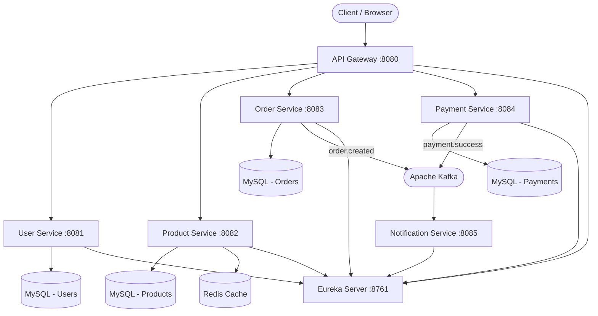

# ShopEase — Microservices E-commerce Backend

A production-grade backend platform for an e-commerce marketplace built with Spring Boot microservices.

## Architecture



## Services

| Service              | Port | Responsibility                                      |
|----------------------|------|-----------------------------------------------------|
| `eureka-server`      | 8761 | Service discovery (Netflix Eureka)                  |
| `api-gateway`        | 8080 | JWT validation, routing, load balancing             |
| `user-service`       | 8081 | Registration, login (BCrypt+JWT), Google OAuth2     |
| `product-service`    | 8082 | Product catalog, Redis caching, exchange rates      |
| `order-service`      | 8083 | Place orders, order history, Kafka producer         |
| `payment-service`    | 8084 | Stripe integration, webhooks, reconciliation cron   |
| `notification-service` | 8085 | Kafka consumer, email notifications              |

## Tech Stack

- **Java 17** + **Spring Boot 3.2**
- **Spring Cloud** (Eureka, Gateway)
- **MySQL 8** (per-service schemas)
- **Redis 7** (product caching)
- **Apache Kafka** (async messaging)
- **Flyway** (schema migrations)
- **JWT + BCrypt + OAuth2** (security)
- **Stripe** (payments)
- **Docker + Docker Compose**
- **Kubernetes** (manifests provided)

## Prerequisites

- Java 17+
- Docker & Docker Compose
- Maven 3.8+

## Quick Start (Docker Compose)

```bash
# Clone the repository
git clone https://github.com/YOUR_USERNAME/shopease.git
cd shopease

# Create .env file (copy from example)
cp .env.example .env
# Edit .env and fill in your secrets

# Start all services
docker-compose up --build -d

# View logs
docker-compose logs -f

# Stop all services
docker-compose down
```

## Environment Variables

| Variable                | Default                            | Description                   |
|-------------------------|------------------------------------|-------------------------------|
| `DB_PASSWORD`           | `shopease_root`                    | MySQL root password           |
| `JWT_SECRET`            | `shopease-secret-...`              | JWT signing key (32+ chars)   |
| `STRIPE_SECRET_KEY`     | `sk_test_placeholder`              | Stripe API secret key         |
| `STRIPE_WEBHOOK_SECRET` | `whsec_placeholder`                | Stripe webhook signing secret |
| `GOOGLE_CLIENT_ID`      | placeholder                        | Google OAuth2 client ID       |
| `GOOGLE_CLIENT_SECRET`  | placeholder                        | Google OAuth2 client secret   |
| `SMTP_HOST`             | `smtp.gmail.com`                   | SMTP server host              |
| `SMTP_PORT`             | `587`                              | SMTP server port              |
| `SMTP_USERNAME`         | placeholder                        | SMTP username / email         |
| `SMTP_PASSWORD`         | placeholder                        | SMTP password / app password  |

## Running Individual Services Locally

```bash
# Start infrastructure (MySQL, Redis, Kafka, Zookeeper)
docker-compose up mysql-user mysql-product mysql-order mysql-payment \
                  redis zookeeper kafka eureka-server -d

# Run a service
cd user-service
mvn spring-boot:run -Dspring-boot.run.profiles=local

# Or build and run JAR
mvn clean package -DskipTests
java -jar target/user-service-1.0.0.jar
```

## API Endpoints

### User Service (`/auth`, `/users`)

| Method | Path                  | Auth   | Description           |
|--------|-----------------------|--------|-----------------------|
| POST   | `/auth/register`      | None   | Register new user     |
| POST   | `/auth/login`         | None   | Login, get JWT token  |
| GET    | `/users/{id}`         | JWT    | Get user profile      |
| PUT    | `/users/{id}`         | JWT    | Update user profile   |

### Product Service (`/products`, `/categories`)

| Method | Path               | Auth  | Description                       |
|--------|--------------------|-------|-----------------------------------|
| GET    | `/products`        | JWT   | List products (paged + sorted)    |
| GET    | `/products/{id}`   | JWT   | Get product by ID (cached)        |
| POST   | `/products`        | JWT   | Create product                    |
| PUT    | `/products/{id}`   | JWT   | Update product                    |
| DELETE | `/products/{id}`   | JWT   | Soft-delete product               |
| GET    | `/categories`      | JWT   | List all categories               |

### Order Service (`/orders`)

| Method | Path                    | Auth | Description           |
|--------|-------------------------|------|-----------------------|
| POST   | `/orders`               | JWT  | Place a new order     |
| GET    | `/orders/{id}`          | JWT  | Get order by ID       |
| GET    | `/orders/user/{userId}` | JWT  | Get orders by user    |

### Payment Service (`/payments`)

| Method | Path                    | Auth   | Description                     |
|--------|-------------------------|--------|---------------------------------|
| POST   | `/payments/initiate`    | JWT    | Create Stripe PaymentIntent     |
| POST   | `/payments/webhook`     | Stripe | Handle Stripe webhook           |
| GET    | `/payments/order/{id}`  | JWT    | Get payment status for order    |

## Running Tests

```bash
# All tests (from project root)
for dir in user-service product-service order-service payment-service notification-service; do
  cd $dir && mvn test && cd ..
done

# Single service
cd user-service && mvn test
```

## Swagger API Docs

After starting services, visit:
- User Service: http://localhost:8081/swagger-ui.html
- Product Service: http://localhost:8082/swagger-ui.html
- Order Service: http://localhost:8083/swagger-ui.html
- Payment Service: http://localhost:8084/swagger-ui.html

## Kubernetes Deployment

```bash
# Create namespace
kubectl create namespace shopease

# Apply ConfigMap
kubectl apply -f k8s/configmap.yaml

# Create secrets (fill values first)
kubectl create secret generic shopease-secrets \
  --from-literal=db-password=YOUR_DB_PASSWORD \
  --from-literal=jwt-secret=YOUR_JWT_SECRET \
  --from-literal=stripe-secret-key=YOUR_STRIPE_KEY \
  --from-literal=stripe-webhook-secret=YOUR_WEBHOOK_SECRET \
  --from-literal=smtp-password=YOUR_SMTP_PASSWORD \
  -n shopease

# Deploy all services
kubectl apply -f k8s/ -n shopease

# Check status
kubectl get pods -n shopease
```

## Project Structure

```
shopease/
├── README.md
├── docker-compose.yml
├── .gitignore
├── eureka-server/
├── api-gateway/
├── user-service/
├── product-service/
├── order-service/
├── payment-service/
├── notification-service/
└── k8s/
    ├── configmap.yaml
    ├── eureka-server.yaml
    ├── api-gateway.yaml
    ├── user-service.yaml
    ├── product-service.yaml
    ├── order-service.yaml
    ├── payment-service.yaml
    └── notification-service.yaml
```

## License

MIT License — see [LICENSE](LICENSE) for details.
